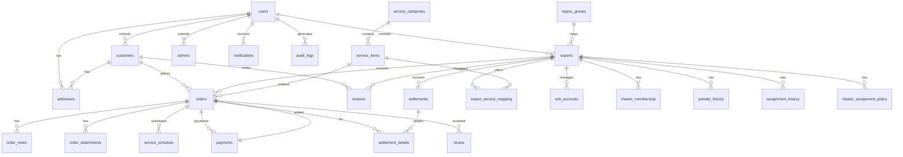

# 데이터베이스 스키마 설계

**문서 버전**: 3.0 (Prisma Schema 기반)  
**작성일**: 2026-02-28  
**우선순위**: P0 (최우선)  
**데이터베이스**: PostgreSQL 16+  
**ORM**: Prisma Client  
**관련 문서**: [01_ARCHITECTURE_DESIGN.md](01_ARCHITECTURE_DESIGN.md)

---

## 📋 목차

1. [설계 원칙](#설계-원칙)
2. [ERD 다이어그램](#erd-다이어그램)
3. [스키마 버전 관리](#스키마-버전-관리)
4. [테이블 상세 설계](#테이블-상세-설계)
5. [전문가 관리 확장 (Expert Management Extension)](#전문가-관리-확장-expert-management-extension)
6. [인덱스 전략](#인덱스-전략)
7. [마이그레이션 계획](#마이그레이션-계획)
8. [성능 고려사항](#성능-고려사항)

---

## 설계 원칙

### 1. 확장성
- **마스터/서브 계정 시스템**: 전문가 팀 운영을 위한 계정 계층 구조 지원
- **3단계 서비스 카테고리**: 대분류 → 중분류 → 서비스 항목 계층적 구조
- **가격 스냅샷 시스템**: 거래 내역 보호를 위한 주문 시점 가격 고정
- **유연한 메타데이터**: JSONB 필드를 통한 확장 가능한 속성 저장

### 2. 무결성
- **외래키 제약조건**: Prisma 관계 정의를 통한 참조 무결성 보장
- **엔티티 소프트 삭제**: `deleted_at` 필드를 통한 논리적 삭제
- **트랜잭션 보장**: Prisma 트랜잭션 API를 통한 일관성 유지
- **열거형 제약**: TypeScript 열거형과 데이터베이스 ENUM 동기화

### 3. 성능
- **전략적 인덱싱**: 조회 패턴 분석 기반 인덱스 설계
- **부분 인덱스**: `WHERE deleted_at IS NULL` 조건의 부분 인덱스 활용
- **GIN 인덱스**: 배열 필드 (`service_regions`, `favorite_categories`) 검색 최적화
- **커버링 인덱스**: 자주 조회되는 필드 포함 인덱스

### 4. 보안
- **민감 정보 암호화**: 애플리케이션 레벨에서 비밀번호, 계좌번호 암호화
- **감사 로그**: 모든 중요한 작업의 `audit_logs` 테이블 기록
- **역할 기반 접근**: 사용자 역할(`UserRole`)에 따른 데이터 접근 제한
- **개인정보 보호**: GDPR 준수를 위한 데이터 보존 정책

### 5. 모니터링
- **성능 메트릭**: 쿼리 성능 모니터링을 위한 Prisma 쿼리 로그
- **용량 계획**: 테이블 성장 예측 및 파티셔닝 전략
- **백업 전략**: 시간 기반 백업 및 PITR(Point-in-Time Recovery)

---

## ERD 다이어그램

### 전체 ERD (Prisma 스키마 기반)


### 핵심 엔티티 관계 설명
1. **사용자 중심 구조**: `users` 테이블을 중심으로 `customers`, `experts`, `admins` 확장
2. **서비스 계층 구조**: `service_categories` → `service_items` → `expert_service_mapping` → `orders`
3. **주문 생명주기**: `orders`를 중심으로 `payments`, `service_schedule`, `reviews` 연결
4. **정산 흐름**: `orders` → `settlement_details` → `settlements` → `experts`

### 관계형 매핑 상세
| 관계 | 타입 | 설명 | 비고 |
|------|------|------|------|
| users → customers | 1:1 | 사용자가 고객으로 확장 | 선택적, 역할이 customer일 때 |
| users → experts | 1:1 | 사용자가 전문가로 확장 | 선택적, 역할이 expert일 때 |
| users → admins | 1:1 | 사용자가 관리자로 확장 | 선택적, 역할이 admin일 때 |
| users → addresses | 1:N | 사용자가 여러 주소 보유 | |
| experts → expert_service_mapping | 1:N | 전문가가 여러 서비스 제공 | 다대다 관계 연결 테이블 |
| service_items → expert_service_mapping | 1:N | 서비스 항목이 여러 전문가와 연결 | 다대다 관계 연결 테이블 |
| orders → payments | 1:N | 주문에 여러 결제 가능 | 보증금, 잔금 분리 결제 |
| settlements → settlement_details | 1:N | 정산에 여러 주문 포함 | 주문별 정산 상세 |

---

## 스키마 버전 관리

### Prisma 마이그레이션 워크플로
```bash
# 1. 스키마 변경
prisma/schema.prisma 수정

# 2. 마이그레이션 생성
npx prisma migrate dev --name "add_master_sub_account"

# 3. 개발 환경 적용
npx prisma migrate dev

# 4. 프로덕션 적용
npx prisma migrate deploy

# 5. Prisma Client 재생성
npx prisma generate
```

### 버전 관리 규칙
1. **스키마 버전**: `3.0.{increment}` 형식 (메이저.마이너.패치)
2. **마이그레이션 네이밍**: `{YYYYMMDD}_{description}` 형식
3. **롤백 전략**: 각 마이그레이션에 대해 롤백 SQL 작성
4. **환경별 관리**: 개발, 스테이징, 프로덕션 별도 마이그레이션

### 데이터 마이그레이션 가이드
```sql
-- 예: 기존 데이터 변환 (레거시 → Prisma)
BEGIN;
  -- 1. users 테이블 데이터 이전
  INSERT INTO prisma.users (id, email, phone, ...)
  SELECT old_id, old_email, old_phone, ... FROM legacy.users;
  
  -- 2. 외래키 재설정
  UPDATE prisma.customers SET user_id = ...;
  
  -- 트랜잭션 커밋
COMMIT;
```

---

## 테이블 상세 설계

### 1. 사용자 관리 (User Management)

#### `users` - 사용자 기본 정보
**기본 엔티티**: 모든 사용자 유형(customer, expert, admin)의 기본 정보 저장

| 필드 | 타입 | 제약 | 설명 |
|------|------|------|------|
| id | String @id @default(cuid()) | PK | CUID 형식의 고유 식별자 |
| email | String @unique | 필수, 고유 | 이메일 주소 (로그인용) |
| phone | String @unique | 필수, 고유 | 휴대폰 번호 (인증용) |
| passwordHash | String @map("password_hash") | 필수 | bcrypt 해시된 비밀번호 |
| name | String | 필수 | 사용자 실명 |
| role | UserRole | 필수 | 사용자 역할 (customer, expert, admin) |
| status | UserStatus @default(active) | 기본값 | 계정 상태 (active, inactive, pending, suspended) |
| avatarUrl | String? @map("avatar_url") | 선택 | 프로필 이미지 URL |
| emailVerified | Boolean @default(false) | 기본값 | 이메일 인증 여부 |
| phoneVerified | Boolean @default(false) | 기본값 | 휴대폰 인증 여부 |
| lastLoginAt | DateTime? @map("last_login_at") | 선택 | 마지막 로그인 시간 |
| metadata | Json? @default("{}") | 선택 | 확장 속성 (JSON) |
| deletedAt | DateTime? @map("deleted_at") | 선택 | 소프트 삭제 타임스탬프 |

**열거형**:
```prisma
enum UserRole { customer, expert, admin }
enum UserStatus { active, inactive, pending, suspended }
```

**비즈니스 규칙**:
- 이메일/휴대폰 중복 불가
- 비밀번호 최소 8자, 영문+숫자+특수문자
- `deleted_at`이 NULL인 경우만 활성 사용자

#### `customers` - 고객 상세 정보
**확장 엔티티**: 고객 역할 사용자의 추가 정보

| 필드 | 타입 | 제약 | 설명 |
|------|------|------|------|
| id | String @id @default(cuid()) | PK | 고유 식별자 |
| userId | String @unique @map("user_id") | FK(users) | 사용자 기본 정보 참조 |
| defaultAddressId | String? @map("default_address_id") | FK(addresses) | 기본 배송지 |
| totalSpent | Float @default(0) | 기본값 | 누적 결제 금액 |
| totalOrders | Int @default(0) | 기본값 | 총 주문 수 |
| favoriteCategories | String[] @default([]) | 배열 | 선호 서비스 카테고리 |
| lastServiceDate | DateTime? | 선택 | 마지막 서비스 이용일 |
| preferences | Json? @default("{}") | 선택 | 고객 선호도 설정 |

**비즈니스 규칙**:
- `users.role = 'customer'`인 경우에만 생성
- `totalSpent`, `totalOrders`는 주문 완료 시 증가

#### `experts` - 마스터 계정 (전문가 사업체) 정보
**확장 엔티티**: 전문가 마스터 계정 (사업체) 정보

| 필드 | 타입 | 제약 | 설명 |
|------|------|------|------|
| id | String @id @default(cuid()) | PK | 고유 식별자 |
| userId | String @unique @map("user_id") | FK(users) | 사용자 기본 정보 참조 |
| businessName | String @map("business_name") | 필수 | 사업체/개인 명 |
| businessNumber | String @unique @map("business_number") | 고유 | 사업자등록번호/주민등록번호 |
| businessType | BusinessType @map("business_type") | 필수 | 사업 유형 (individual, corporate) |
| serviceRegions | String[] @map("service_regions") | 배열 | 서비스 가능 지역 (시/구 단위) |
| approval_status | ExpertApprovalStatus @default(PENDING) | 기본값 | 승인 상태 (PENDING, APPROVED, REJECTED) |
| active_status | ExpertActiveStatus @default(INACTIVE) | 기본값 | 활성 상태 (ACTIVE, INACTIVE) |
| membership_enabled | Boolean @default(false) | 기본값 | 멤버십 활성화 여부 |
| membership_slot_count | Int @default(0) | 기본값 | 멤버십 구좌 수 |
| service_category_mid_available_list | String[] @default([]) | 배열 | 서비스 가능 중분류 ID 목록 |
| region_groups | String[] @default([]) | 배열 | 서비스 가능 권역 그룹 (수도권, 충청, 영남, 호남, 제주) |
| operational_status | ExpertOperationalStatus @default(active) | 기본값 | 운영 상태 (active, inactive, busy, vacation) |
| bankName | String? @map("bank_name") | 선택 | 은행명 |
| accountNumber | String? @map("account_number") | 선택 | 계좌번호 |
| accountHolder | String? @map("account_holder") | 선택 | 예금주 |
| certificateUrls | String[] @default([]) | 배열 | 자격증/인증서 URL |
| portfolioImages | String[] @default([]) | 배열 | 포트폴리오 이미지 URL |

**열거형**:
```prisma
enum BusinessType { individual, corporate }
enum ExpertApprovalStatus { PENDING, APPROVED, REJECTED }
enum ExpertActiveStatus { ACTIVE, INACTIVE }
enum ExpertOperationalStatus { active, inactive, busy, vacation }
```

**비즈니스 규칙**:
- `users.role = 'expert'`인 경우에만 생성 (마스터 계정)
- `businessNumber`는 사업자/개인 식별용 고유값
- `serviceRegions` 배열은 지역 검색에 사용
- `rating`은 리뷰 평점의 이동 평균 계산
- `approval_status`와 `active_status` 조합 규칙: PENDING + ACTIVE 금지, APPROVED + ACTIVE만 운영 가능
- `membership_enabled = true`인 경우 `approval_status = APPROVED` 및 `active_status = ACTIVE` 필수
- 멤버십 구좌 수(`membership_slot_count`)는 마스터 계정 단위로 관리되며, 멤버십 전문가 판단 기준으로 사용됨
- `service_category_mid_available_list`는 `service_subcategories.id` 참조
- `region_groups`는 `region_groups` 테이블 기준 매핑

#### `admins` - 관리자 상세 정보
**확장 엔티티**: 관리자 역할 사용자의 추가 정보

| 필드 | 타입 | 제약 | 설명 |
|------|------|------|------|
| id | String @id @default(cuid()) | PK | 고유 식별자 |
| userId | String @unique @map("user_id") | FK(users) | 사용자 기본 정보 참조 |
| department | String? | 선택 | 부서 |
| position | String? | 선택 | 직책 |
| permissions | String[] @default([]) | 배열 | 세부 권한 목록 |
| lastActiveAt | DateTime? @map("last_active_at") | 선택 | 마지막 활동 시간 |

**비즈니스 규칙**:
- `users.role = 'admin'`인 경우에만 생성
- `permissions` 배열은 RBAC 세부 권한 관리

### 2. 서비스 카탈로그 (Service Catalog)

#### `service_categories` - 서비스 대분류 (Level 1)
**계층 구조**: 서비스의 최상위 분류 (예: "설치/시공", "클리닝", "막힘해결")

| 필드 | 타입 | 제약 | 설명 |
|------|------|------|------|
| id | String @id @default(cuid()) | PK | 고유 식별자 |
| code | String @unique | 고유 | 2자리 숫자 코드 (예: "04") |
| name | String @unique | 고유 | 대분류명 (한글) |
| description | String? | 선택 | 카테고리 설명 |
| displayOrder | Int @default(0) @map("display_order") | 기본값 | 표시 순서 |
| isActive | Boolean @default(true) @map("is_active") | 기본값 | 활성화 여부 |
| createdAt | DateTime @default(now()) @map("created_at") | 기본값 | 생성 시간 |
| updatedAt | DateTime @default(now()) @updatedAt @map("updated_at") | 기본값 | 수정 시간 |

**비즈니스 규칙**:
- `code`는 2자리 숫자로 자동 생성, 수정 불가
- `displayOrder`로 프론트엔드 표시 순서 제어
- `isActive = false`인 경우 숨김 처리

#### `service_subcategories` - 서비스 중분류 (Level 2)
**계층 구조**: 대분류 하위의 중간 분류 (예: "에어컨", "세탁기", "냉장고")

| 필드 | 타입 | 제약 | 설명 |
|------|------|------|------|
| id | String @id @default(cuid()) | PK | 고유 식별자 |
| categoryId | String @map("category_id") | FK(service_categories) | 상위 대분류 참조 |
| code | String | 고유 | 4자리 숫자 코드 (예: "0401") |
| name | String | 필수 | 중분류명 (한글) |
| description | String? | 선택 | 중분류 설명 |
| membershipAvailable | Boolean @default(false) @map("membership_available") | 기본값 | 멤버십 적용 가능 여부 |
| displayOrder | Int @default(0) @map("display_order") | 기본값 | 표시 순서 |
| isActive | Boolean @default(true) @map("is_active") | 기본값 | 활성화 여부 |
| createdAt | DateTime @default(now()) @map("created_at") | 기본값 | 생성 시간 |
| updatedAt | DateTime @default(now()) @updatedAt @map("updated_at") | 기본값 | 수정 시간 |

**비즈니스 규칙**:
- `code`는 상위 대분류 코드 + 2자리 숫자 (예: "04" + "01" = "0401")
- `membershipAvailable = true`인 경우 멤버십 배정 로직에서 우선 배정 대상
- 중분류 단위로 멤버십 가입 관리

#### `service_items` - 서비스 소분류 (Level 3)
**계층 구조**: 중분류 하위의 구체적 서비스 (예: "에어컨 설치", "에어컨 청소")

| 필드 | 타입 | 제약 | 설명 |
|------|------|------|------|
| id | String @id @default(cuid()) | PK | 고유 식별자 |
| subcategoryId | String @map("subcategory_id") | FK(service_subcategories) | 상위 중분류 참조 |
| code | String | 고유 | 6자리 숫자 코드 (예: "040101") |
| name | String | 필수 | 서비스 항목명 |
| description | String? | 선택 | 서비스 설명 |
| displayOrder | Int @default(0) @map("display_order") | 기본값 | 표시 순서 |
| isActive | Boolean @default(true) @map("is_active") | 기본값 | 활성화 여부 |
| createdAt | DateTime @default(now()) @map("created_at") | 기본값 | 생성 시간 |
| updatedAt | DateTime @default(now()) @updatedAt @map("updated_at") | 기본값 | 수정 시간 |

**비즈니스 규칙**:
- `code`는 상위 중분류 코드 + 2자리 숫자 (예: "0401" + "01" = "040101")
- 주문 생성 시 필수 선택 단위
- 기본비용, 현장비용, 수수료 설정 가능한 최소 단위

#### `service_item_prices` - 서비스 기본비용 관리
**가격 이력**: 소분류별 기본 가격 및 단위 정보

| 필드 | 타입 | 제약 | 설명 |
|------|------|------|------|
| id | String @id @default(cuid()) | PK | 고유 식별자 |
| serviceItemId | String @map("service_item_id") | FK(service_items) | 서비스 소분류 참조 |
| basePrice | Float @map("base_price") | 필수 | 기본 가격 |
| unitType | UnitType @map("unit_type") | 필수 | 단위 타입 (EA, 면적, 시간 등) |
| minPrice | Float? @map("min_price") | 선택 | 최소 금액 |
| vatIncluded | Boolean @default(true) @map("vat_included") | 기본값 | VAT 포함 여부 |
| effectiveStartDate | DateTime @map("effective_start_date") | 필수 | 적용 시작일 |
| effectiveEndDate | DateTime? @map("effective_end_date") | 선택 | 적용 종료일 (신규 가격 생성 시 자동 설정) |
| priceVersion | Int @default(1) @map("price_version") | 기본값 | 가격 버전 |
| isActive | Boolean @default(true) @map("is_active") | 기본값 | 활성화 여부 |
| createdAt | DateTime @default(now()) @map("created_at") | 기본값 | 생성 시간 |
| createdBy | String @map("created_by") | FK(users) | 생성자 |

**열거형**:
```prisma
enum UnitType {
  EA      // 개수
  AREA    // 면적 (㎡)
  TIME    // 시간
  METER   // 미터
  SET     // 세트
}
```

**비즈니스 규칙**:
- 동일 `serviceItemId`에 대해 `effectiveStartDate` 중복 불가
- 신규 가격 생성 시 기존 가격의 `effectiveEndDate` 자동 설정
- `priceVersion`은 `serviceItemId`별로 증가
- 주문 생성 시점의 활성 가격을 스냅샷으로 저장

#### `on_site_fee_categories` - 현장비용 카테고리 마스터
**마스터 데이터**: 모든 현장비용 항목 정의

| 필드 | 타입 | 제약 | 설명 |
|------|------|------|------|
| id | String @id @default(cuid()) | PK | 고유 식별자 |
| code | String @unique | 고유 | 현장비용 코드 |
| name | String | 필수 | 현장비용명 |
| description | String? | 선택 | 설명 |
| feeType | FeeType @map("fee_type") | 필수 | 과금 방식 |
| baseAmount | Float @map("base_amount") | 필수 | 기본 금액 |
| vatIncluded | Boolean @default(true) @map("vat_included") | 기본값 | VAT 포함 여부 |
| settlementIncluded | Boolean @default(true) @map("settlement_included") | 기본값 | 정산 반영 여부 |
| isActive | Boolean @default(true) @map("is_active") | 기본값 | 활성화 여부 |
| createdAt | DateTime @default(now()) @map("created_at") | 기본값 | 생성 시간 |
| updatedAt | DateTime @default(now()) @updatedAt @map("updated_at") | 기본값 | 수정 시간 |

**열거형**:
```prisma
enum FeeType {
  FIXED       // 고정금액
  UNIT_BASED  // 단가 × 수량
}
```

**비즈니스 규칙**:
- `feeType = UNIT_BASED`인 경우 수량 입력 필요
- `settlementIncluded = false`인 경우 플랫폼 수익으로만 처리, 전문가 정산 제외

#### `service_category_on_site_fee_mappings` - 서비스-현장비용 매핑
**매핑 관계**: 서비스 카테고리(중분류/소분류)와 현장비용 카테고리 연결

| 필드 | 타입 | 제약 | 설명 |
|------|------|------|------|
| id | String @id @default(cuid()) | PK | 고유 식별자 |
| serviceCategoryId | String @map("service_category_id") | FK(service_subcategories 또는 service_items) | 서비스 카테고리 참조 |
| serviceCategoryType | ServiceCategoryType @map("service_category_type") | 필수 | 서비스 카테고리 타입 (SUBCATEGORY, ITEM) |
| onSiteFeeCategoryId | String @map("on_site_fee_category_id") | FK(on_site_fee_categories) | 현장비용 카테고리 참조 |
| mappingLevel | MappingLevel @default(LEVEL2) @map("mapping_level") | 기본값 | 매핑 레벨 (중분류/소분류) |
| isRequired | Boolean @default(false) @map("is_required") | 기본값 | 필수 여부 |
| maxQuantity | Int? @map("max_quantity") | 선택 | 최대 수량 제한 |
| effectiveStartDate | DateTime @map("effective_start_date") | 필수 | 적용 시작일 |
| effectiveEndDate | DateTime? @map("effective_end_date") | 선택 | 적용 종료일 |
| mappingVersion | Int @default(1) @map("mapping_version") | 기본값 | 매핑 버전 |
| isActive | Boolean @default(true) @map("is_active") | 기본값 | 활성화 여부 |
| createdAt | DateTime @default(now()) @map("created_at") | 기본값 | 생성 시간 |
| createdBy | String @map("created_by") | FK(users) | 생성자 |

**열거형**:
```prisma
enum ServiceCategoryType {
  SUBCATEGORY  // 중분류
  ITEM         // 소분류
}

enum MappingLevel {
  LEVEL2  // 중분류 기준 매핑
  LEVEL3  // 소분류 기준 매핑
}
```

**비즈니스 규칙**:
- `serviceCategoryType` + `serviceCategoryId` + `onSiteFeeCategoryId` 중복 불가
- 우선순위: 소분류 매핑 > 중분류 매핑
- 신규 매핑 생성 시 기존 매핑 종료일 자동 설정

#### `service_category_extra_fields` - 서비스 추가입력항목
**동적 필드**: 서비스 카테고리별 추가 입력 필드 정의

| 필드 | 타입 | 제약 | 설명 |
|------|------|------|------|
| id | String @id @default(cuid()) | PK | 고유 식별자 |
| serviceCategoryId | String @map("service_category_id") | FK(service_subcategories 또는 service_items) | 서비스 카테고리 참조 |
| serviceCategoryType | ServiceCategoryType @map("service_category_type") | 필수 | 서비스 카테고리 타입 (SUBCATEGORY, ITEM) |
| fieldKey | String | 필수 | 필드 키 (영문/숫자 조합) |
| label | String | 필수 | 표시명 (한글) |
| fieldType | FieldType @map("field_type") | 필수 | 필드 타입 |
| options | Json? @default("[]") | 선택 | SELECT 타입 옵션 목록 |
| isRequired | Boolean @default(false) @map("is_required") | 기본값 | 필수 여부 |
| displayLocation | DisplayLocation @default(BOTH) @map("display_location") | 기본값 | 노출 위치 |
| sortOrder | Int @default(0) @map("sort_order") | 기본값 | 정렬 순서 |
| isActive | Boolean @default(true) @map("is_active") | 기본값 | 활성화 여부 |
| createdAt | DateTime @default(now()) @map("created_at") | 기본값 | 생성 시간 |
| updatedAt | DateTime @default(now()) @updatedAt @map("updated_at") | 기본값 | 수정 시간 |

**열거형**:
```prisma
enum FieldType {
  TEXT
  NUMBER
  DATE
  SELECT
  CHECKBOX
  RADIO
}

enum DisplayLocation {
  ORDER_BACKOFFICE_ONLY  // 주문관리 백오피스만
  EXPERT_APP_ONLY        // 전문가웹앱만
  BOTH                   // 모두
}
```

**비즈니스 규칙**:
- `fieldKey`는 서비스 카테고리 내 고유, 수정 불가
- `fieldType = SELECT`인 경우 `options` 필수
- 중분류 필드는 하위 소분류에 상속 적용 (소분류에서 오버라이드 가능)

#### `channels` - 채널 마스터
**채널 관리**: 주문 유입 채널 마스터 (자사/제휴사)

|| 필드 | 타입 | 제약 | 설명 |
||------|------|------|------|
|| id | String @id @default(cuid()) | PK | 고유 식별자 |
|| channelCode | String @unique @map("channel_code") | 고유 | 채널 코드 (영문/숫자 조합) |
|| channelName | String @unique @map("channel_name") | 고유 | 채널명 (주문관리/전문가웹앱 노출용) |
|| channelType | ChannelType @map("channel_type") | 필수 | 채널 유형 (INTERNAL/PARTNER) |
|| channelStatus | ChannelStatus @default(ACTIVE) @map("channel_status") | 기본값 | 채널 상태 (ACTIVE/INACTIVE) |
|| partnerCompanyName | String? @map("partner_company_name") | 선택 | 제휴사명 (channel_type = PARTNER인 경우 필수) |
|| partnerContactName | String? @map("partner_contact_name") | 선택 | 제휴 담당자명 |
|| partnerContactEmail | String? @map("partner_contact_email") | 선택 | 제휴 담당자 이메일 |
|| partnerContactPhone | String? @map("partner_contact_phone") | 선택 | 제휴 담당자 전화번호 |
|| note | String? @map("note") | 선택 | 내부 운영 메모 |
|| sortOrder | Int @default(0) @map("sort_order") | 기본값 | 정렬 순서 |
|| createdAt | DateTime @default(now()) @map("created_at") | 기본값 | 생성 시간 |
|| updatedAt | DateTime @default(now()) @updatedAt @map("updated_at") | 기본값 | 수정 시간 |
|| createdBy | String @map("created_by") | FK(users) | 생성자 |
|| updatedBy | String? @map("updated_by") | FK(users) | 수정자 |

**열거형**:
```prisma
enum ChannelType {
  INTERNAL  // 자사 채널
  PARTNER   // 제휴사 채널
}

enum ChannelStatus {
  ACTIVE    // 활성
  INACTIVE  // 비활성
}
```

**비즈니스 규칙**:
- `channelCode`, `channelName`, `channelType`은 생성 후 수정 불가 (불변 필드)
- `channel_type = PARTNER`인 경우 `partnerCompanyName` 필수
- `channelStatus = INACTIVE`인 경우 신규 주문 생성 불가
- `channelCode`는 영문/숫자 조합 권장, 시스템 내 고유
- `channelName`은 주문관리 및 전문가웹앱에 노출되는 공식 명칭

#### `service_category_channel_commissions` - 채널별 수수료 설정
**채널 수수료**: 소분류별 채널 수수료 정책

| 필드 | 타입 | 제약 | 설명 |
|------|------|------|------|
| id | String @id @default(cuid()) | PK | 고유 식별자 |
| serviceItemId | String @map("service_item_id") | FK(service_items) | 서비스 소분류 참조 |
| channelCode | String @map("channel_code") | 필수 | 채널 코드 |
| commissionType | CommissionType @map("commission_type") | 필수 | 수수료 타입 |
| commissionValue | Float @map("commission_value") | 필수 | 수수료 값 |
| vatBasis | VatBasis @default(INCLUDED) @map("vat_basis") | 기본값 | VAT 기준 |
| effectiveStartDate | DateTime @map("effective_start_date") | 필수 | 적용 시작일 |
| effectiveEndDate | DateTime? @map("effective_end_date") | 선택 | 적용 종료일 |
| commissionVersion | Int @default(1) @map("commission_version") | 기본값 | 수수료 버전 |
| isActive | Boolean @default(true) @map("is_active") | 기본값 | 활성화 여부 |
| createdAt | DateTime @default(now()) @map("created_at") | 기본값 | 생성 시간 |
| createdBy | String @map("created_by") | FK(users) | 생성자 |

**열거형**:
```prisma
enum CommissionType {
  RATE   // 퍼센트 수수료
  FIXED  // 고정 수수료
}

enum VatBasis {
  INCLUDED  // VAT 포함 기준
  EXCLUDED  // VAT 제외 기준
}
```

**비즈니스 규칙**:
- 동일 `serviceItemId` + `channelCode` + `effectiveStartDate` 중복 불가
- `commissionType = RATE`일 경우 0 ≤ `commissionValue` ≤ 100
- 신규 수수료 생성 시 기존 수수료 종료일 자동 설정

#### `expert_service_mapping` - 전문가-서비스 매핑
**다대다 관계**: 전문가가 제공하는 서비스와 가격 설정

| 필드 | 타입 | 제약 | 설명 |
|------|------|------|------|
| id | String @id @default(cuid()) | PK | 고유 식별자 |
| expertId | String @map("expert_id") | FK(experts) | 전문가 참조 |
| serviceItemId | String @map("service_item_id") | FK(service_items) | 서비스 소분류 참조 |
| customPrice | Float? @map("custom_price") | 선택 | 전문가별 커스텀 가격 |
| isAvailable | Boolean @default(true) @map("is_available") | 기본값 | 제공 가능 여부 |
| createdAt | DateTime @default(now()) @map("created_at") | 기본값 | 생성 시간 |
| updatedAt | DateTime @default(now()) @updatedAt @map("updated_at") | 기본값 | 수정 시간 |

**비즈니스 규칙**:
- `expertId` + `serviceItemId` 복합 유니크 제약
- `customPrice`가 NULL인 경우 `service_item_prices.basePrice` 사용
- `isAvailable = false`인 경우 해당 서비스 제공 불가### 3. 주문 관리 (Order Management)

#### `orders` - 주문 메인
**핵심 엔티티**: 서비스 주문의 모든 정보 포함

| 필드 | 타입 | 제약 | 설명 |
|------|------|------|------|
| id | String @id @default(cuid()) | PK | 고유 식별자 |
| orderNumber | String @unique @map("order_number") | 고유 | 주문번호 (시스템 생성) |
| customerId | String @map("customer_id") | FK(customers) | 고객 참조 |
| expertId | String? @map("expert_id") | FK(experts) | 전문가 참조 (수락 시) |
| serviceItemId | String @map("service_item_id") | FK(service_items) | 서비스 항목 참조 |
| serviceCategoryCode | String? @map("service_category_code") | 선택 | 대분류 코드 (스냅샷) |
| serviceSubcategoryCode | String? @map("service_subcategory_code") | 선택 | 중분류 코드 (스냅샷) |
| serviceItemCode | String? @map("service_item_code") | 선택 | 소분류 코드 (스냅샷) |
| membershipSubcategoryCode | String? @map("membership_subcategory_code") | 선택 | 멤버십 적용 기준 중분류 코드 (스냅샷) |
| addressId | String @map("address_id") | FK(addresses) | 서비스 주소 참조 |
| status | OrderStatus @default(new) | 기본값 | 주문 상태 |
| paymentStatus | PaymentStatus @default(pending) | 기본값 | 결제 상태 |
| requestedDate | DateTime @map("requested_date") | 필수 | 희망 서비스 날짜 |
| confirmedDate | DateTime? @map("confirmed_date") | 선택 | 전문가 확정 날짜 |
| startedAt | DateTime? @map("started_at") | 선택 | 서비스 시작 시간 |
| completedAt | DateTime? @map("completed_at") | 선택 | 서비스 완료 시간 |
| basePrice | Float @map("base_price") | 필수 | 주문 시점 서비스 가격 (스냅샷) |
| onsiteCosts | Json? @default("[]") @map("onsite_costs") | 선택 | 현장 추가 비용 |
| discountAmount | Float @default(0) @map("discount_amount") | 기본값 | 할인 금액 |
| depositAmount | Float @map("deposit_amount") | 필수 | 보증금 금액 |
| totalAmount | Float @map("total_amount") | 필수 | 총 결제 금액 |
| paidAmount | Float @default(0) @map("paid_amount") | 기본값 | 실제 결제 금액 |
| customerNotes | String? @map("customer_notes") | 선택 | 고객 특이사항 |
| expertNotes | String? @map("expert_notes") | 선택 | 전문가 메모 |
| cancellationReason | String? @map("cancellation_reason") | 선택 | 취소 사유 |
| metadata | Json? @default("{}") @map("metadata") | 선택 | 추가 메타데이터 (JSON) |

**열거형**:
```prisma
enum OrderStatus {
  new
  consult_required
  schedule_pending
  schedule_confirmed
  in_progress
  payment_pending
  paid
  as_requested
  cancelled
}

enum PaymentStatus {
  pending
  deposit_paid
  balance_pending
  balance_paid
  refunded
}
```

**비즈니스 규칙**:
- `orderNumber`: "SSG-{YYYYMMDD}-{6자리순번}" 형식
- `basePrice`: 주문 생성 시점의 서비스 가격 고정 (가격 스냅샷)
- `serviceCategoryCode`, `serviceSubcategoryCode`, `serviceItemCode`, `membershipSubcategoryCode`: 주문 생성 시점의 서비스 카테고리 코드 고정 (멤버십 정책, 보고서용 스냅샷)
- `metadata`: 추가 메타데이터 (JSON) 확장 용도
- 상태 전이: new → consult_required/schedule_pending → schedule_confirmed → ...
- 결제 상태 전이: pending → deposit_paid → balance_pending → balance_paid

#### `order_notes` - 주문 메모
**부가 엔티티**: 주문 관련 내부/외부 메모

| 필드 | 타입 | 제약 | 설명 |
|------|------|------|------|
| id | String @id @default(cuid()) | PK | 고유 식별자 |
| orderId | String @map("order_id") | FK(orders) | 주문 참조 |
| authorId | String @map("author_id") | FK(users) | 작성자 참조 |
| authorType | AuthorType @map("author_type") | 필수 | 작성자 유형 |
| content | String | 필수 | 메모 내용 |
| isInternal | Boolean @default(false) @map("is_internal") | 기본값 | 내부 메모 여부 |

**열거형**:
```prisma
enum AuthorType { customer, expert, admin }
```

**비즈니스 규칙**:
- `isInternal = true`인 경우 고객에게 노출되지 않음
- `authorType`에 따라 UI에서 다르게 표시

#### `order_attachments` - 주문 첨부파일
**부가 엔티티**: 주문 관련 파일 (사진, 영수증, 문서)

| 필드 | 타입 | 제약 | 설명 |
|------|------|------|------|
| id | String @id @default(cuid()) | PK | 고유 식별자 |
| orderId | String @map("order_id") | FK(orders) | 주문 참조 |
| uploaderId | String @map("uploader_id") | FK(users) | 업로더 참조 |
| fileName | String @map("file_name") | 필수 | 원본 파일명 |
| fileUrl | String @map("file_url") | 필수 | 파일 저장 URL |
| fileType | String? @map("file_type") | 선택 | 파일 MIME 타입 |
| fileSize | Int? @map("file_size") | 선택 | 파일 크기 (바이트) |
| attachmentType | AttachmentType? @map("attachment_type") | 선택 | 첨부파일 유형 |

**열거형**:
```prisma
enum AttachmentType { before, after, receipt, other }
```

**비즈니스 규칙**:
- 파일 크기 제한: 10MB 이하
- 허용 확장자: 이미지(jpg, png, gif), PDF, 문서(doc, docx)
- `attachmentType`에 따라 파일 분류

#### `service_schedule` - 서비스 일정
**부가 엔티티**: 확정된 서비스 일정 정보

| 필드 | 타입 | 제약 | 설명 |
|------|------|------|------|
| id | String @id @default(cuid()) | PK | 고유 식별자 |
| orderId | String @unique @map("order_id") | FK(orders) | 주문 참조 (1:1) |
| expertId | String @map("expert_id") | FK(experts) | 전문가 참조 |
| scheduledDate | DateTime @map("scheduled_date") | 필수 | 서비스 날짜 |
| startTime | String @map("start_time") | 필수 | 시작 시간 (HH:MM) |
| endTime | String @map("end_time") | 필수 | 종료 시간 (HH:MM) |
| status | ScheduleStatus @default(scheduled) | 기본값 | 일정 상태 |
| notes | String? | 선택 | 일정 특이사항 |

**열거형**:
```prisma
enum ScheduleStatus { scheduled, in_progress, completed, cancelled }
```

**비즈니스 규칙**:
- `orderId`와 1:1 관계 (주문당 하나의 일정)
- 전문가의 중복 일정 방지 필요
- `scheduledDate` + `startTime`/`endTime`으로 실제 서비스 시간 관리

### 4. 결제 및 정산 (Payment & Settlement)

#### `payments` - 결제 거래
**핵심 엔티티**: 주문에 대한 결제 내역

| 필드 | 타입 | 제약 | 설명 |
|------|------|------|------|
| id | String @id @default(cuid()) | PK | 고유 식별자 |
| orderId | String @map("order_id") | FK(orders) | 주문 참조 |
| paymentNumber | String @unique @map("payment_number") | 고유 | 결제번호 (PG사/시스템) |
| paymentType | PaymentType @map("payment_type") | 필수 | 결제 유형 |
| method | PaymentMethod? | 선택 | 결제 수단 |
| amount | Float | 필수 | 결제 금액 |
| status | PaymentTransactionStatus @default(pending) | 기본값 | 결제 상태 |
| pgProvider | String? @map("pg_provider") | 선택 | PG사 (Hecto 등) |
| pgTransactionId | String? @map("pg_transaction_id") | 선택 | PG사 거래 ID |
| pgResponse | Json? @map("pg_response") | 선택 | PG 응답 원본 |
| paidAt | DateTime? @map("paid_at") | 선택 | 결제 완료 시간 |
| refundedAt | DateTime? @map("refunded_at") | 선택 | 환불 시간 |
| refundAmount | Float @default(0) @map("refund_amount") | 기본값 | 환불 금액 |
| refundReason | String? @map("refund_reason") | 선택 | 환불 사유 |

**열거형**:
```prisma
enum PaymentType { deposit, balance, full }
enum PaymentMethod { credit_card, virtual_account, simple_payment, cash }
enum PaymentTransactionStatus { pending, completed, failed, cancelled, refunded }
```

**비즈니스 규칙**:
- `paymentNumber`: "PAY-{YYYYMMDD}-{6자리순번}" 또는 PG사 거래번호
- 한 주문에 여러 결제 가능 (보증금 + 잔금)
- `pgResponse`에 PG사 원본 응답 저장 (디버깅용)

#### `settlements` - 전문가 정산
**핵심 엔티티**: 전문가별 주기적 정산 정보

| 필드 | 타입 | 제약 | 설명 |
|------|------|------|------|
| id | String @id @default(cuid()) | PK | 고유 식별자 |
| expertId | String @map("expert_id") | FK(experts) | 전문가 참조 |
| settlementNumber | String @unique @map("settlement_number") | 고유 | 정산번호 |
| periodStart | DateTime @map("period_start") | 필수 | 정산 기간 시작 |
| periodEnd | DateTime @map("period_end") | 필수 | 정산 기간 종료 |
| totalOrders | Int @default(0) @map("total_orders") | 기본값 | 정산 대상 주문 수 |
| totalRevenue | Float @default(0) @map("total_revenue") | 기본값 | 총 매출액 |
| platformFee | Float @default(0) @map("platform_fee") | 기본값 | 플랫폼 수수료 |
| paymentFee | Float @default(0) @map("payment_fee") | 기본값 | 결제 수수료 |
| taxAmount | Float @default(0) @map("tax_amount") | 기본값 | 부가세 |
| netAmount | Float @default(0) @map("net_amount") | 기본값 | 실 지급액 |
| status | SettlementStatus @default(pending) | 기본값 | 정산 상태 |
| approvedAt | DateTime? @map("approved_at") | 선택 | 정산 승인 시간 |
| paidAt | DateTime? @map("paid_at") | 선택 | 지급 완료 시간 |
| bankName | String? @map("bank_name") | 선택 | 지급 은행 |
| accountNumber | String? @map("account_number") | 선택 | 지급 계좌 |
| accountHolder | String? @map("account_holder") | 선택 | 예금주 |

**열거형**:
```prisma
enum SettlementStatus { pending, approved, paid, cancelled }
```

**비즈니스 규칙**:
- `settlementNumber`: "SETTLE-{YYYYMM}-{전문가ID}-{순번}"
- `periodStart`/`periodEnd`: 일반적으로 월 단위 정산
- `netAmount = totalRevenue - platformFee - paymentFee - taxAmount`
- 상태 전이: pending → approved → paid

#### `settlement_details` - 정산 상세
**부가 엔티티**: 정산에 포함된 개별 주문 정보

| 필드 | 타입 | 제약 | 설명 |
|------|------|------|------|
| id | String @id @default(cuid()) | PK | 고유 식별자 |
| settlementId | String @map("settlement_id") | FK(settlements) | 정산 참조 |
| orderId | String @map("order_id") | FK(orders) | 주문 참조 |
| orderAmount | Float @map("order_amount") | 필수 | 주문 금액 |
| platformFee | Float @map("platform_fee") | 필수 | 해당 주문 플랫폼 수수료 |
| paymentFee | Float @map("payment_fee") | 필수 | 해당 주문 결제 수수료 |
| netAmount | Float @map("net_amount") | 필수 | 해당 주문 실 지급액 |

**비즈니스 규칙**:
- `settlementId` + `orderId` 복합 유니크 제약
- 정산 생성 시 해당 기간의 완료된 주문 자동 포함

### 5. 리뷰 및 평가 (Reviews & Ratings)

#### `reviews` - 서비스 리뷰
**핵심 엔티티**: 완료된 주문에 대한 고객 리뷰

| 필드 | 타입 | 제약 | 설명 |
|------|------|------|------|
| id | String @id @default(cuid()) | PK | 고유 식별자 |
| orderId | String @unique @map("order_id") | FK(orders) | 주문 참조 (1:1) |
| customerId | String @map("customer_id") | FK(customers) | 고객 참조 |
| expertId | String @map("expert_id") | FK(experts) | 전문가 참조 |
| rating | Int | 필수 | 평점 (1-5) |
| title | String? | 선택 | 리뷰 제목 |
| content | String | 필수 | 리뷰 내용 |
| images | String[] @default([]) | 배열 | 리뷰 이미지 |
| isVerified | Boolean @default(true) @map("is_verified") | 기본값 | 검증된 리뷰 여부 |
| isApproved | Boolean @default(false) @map("is_approved") | 기본값 | 관리자 승인 여부 |
| approvedAt | DateTime? @map("approved_at") | 선택 | 승인 시간 |
| helpfulCount | Int @default(0) @map("helpful_count") | 기본값 | 도움이 됐어요 카운트 |

**비즈니스 규칙**:
- `orderId`와 1:1 관계 (주문당 하나의 리뷰)
- `rating`은 1-5 범위
- `isVerified = true`: 실제 서비스 이용 고객의 리뷰
- `isApproved = false`인 경우 공개되지 않음

### 6. 시스템 관리 (System Management)

#### `notifications` - 시스템 알림
**부가 엔티티**: 사용자별 알림 메시지

| 필드 | 타입 | 제약 | 설명 |
|------|------|------|------|
| id | String @id @default(cuid()) | PK | 고유 식별자 |
| userId | String @map("user_id") | FK(users) | 사용자 참조 |
| type | String | 필수 | 알림 유형 |
| title | String | 필수 | 알림 제목 |
| message | String | 필수 | 알림 내용 |
| data | Json? @default("{}") | 선택 | 추가 데이터 (JSON) |
| isRead | Boolean @default(false) @map("is_read") | 기본값 | 읽음 여부 |
| readAt | DateTime? @map("read_at") | 선택 | 읽은 시간 |

**비즈니스 규칙**:
- `type`: "order_created", "payment_completed", "schedule_reminder" 등
- `data`에 관련 엔티티 ID 등 추가 정보 저장
- 읽지 않은 알림은 배지 등으로 표시

#### `audit_logs` - 감사 로그
**부가 엔티티**: 시스템 중요 작업 로그

| 필드 | 타입 | 제약 | 설명 |
|------|------|------|------|
| id | String @id @default(cuid()) | PK | 고유 식별자 |
| userId | String? @map("user_id") | FK(users) | 사용자 참조 (선택) |
| action | String | 필수 | 작업 유형 |
| entityType | String @map("entity_type") | 필수 | 대상 엔티티 |
| entityId | String? @map("entity_id") | 선택 | 대상 엔티티 ID |
| oldValues | Json? @map("old_values") | 선택 | 변경 전 값 |
| newValues | Json? @map("new_values") | 선택 | 변경 후 값 |
| ipAddress | String? @map("ip_address") | 선택 | 요청 IP |
| userAgent | String? @map("user_agent") | 선택 | 사용자 에이전트 |

**비즈니스 규칙**:
- `userId`가 NULL인 경우 시스템 작업
- `oldValues`/`newValues`는 변경된 필드만 저장
- 6개월 이상 된 로그는 아카이브

#### `addresses` - 주소 정보
**공용 엔티티**: 사용자, 주문, 전문가 사업장 주소

| 필드 | 타입 | 제약 | 설명 |
|------|------|------|------|
| id | String @id @default(cuid()) | PK | 고유 식별자 |
| userId | String @map("user_id") | FK(users) | 사용자 참조 |
| label | String | 필수 | 주소 라벨 (예: "집", "회사") |
| addressLine1 | String @map("address_line1") | 필수 | 기본 주소 |
| addressLine2 | String? @map("address_line2") | 선택 | 상세 주소 |
| city | String | 필수 | 시/도 |
| state | String | 필수 | 구/군 |
| postalCode | String @map("postal_code") | 필수 | 우편번호 |
| country | String @default("South Korea") | 기본값 | 국가 |
| isDefault | Boolean @default(false) @map("is_default") | 기본값 | 기본 주소 여부 |
| latitude | Float? | 선택 | 위도 |
| longitude | Float? | 선택 | 경도 |

**비즈니스 규칙**:
- 사용자별 `isDefault = true` 주소는 하나만 존재
- `latitude`/`longitude`는 지도 서비스 연동 시 사용

---

## 5. 전문가 관리 확장 (Expert Management Extension)

### `sub_accounts` - 서브 계정 정보
**하위 엔티티**: 마스터 계정 소속 개인 수행자 계정

| 필드 | 타입 | 제약 | 설명 |
|------|------|------|------|
| id | String @id @default(cuid()) | PK | 고유 식별자 |
| master_account_id | String @map("master_account_id") | FK(experts) | 소속 마스터 계정 |
| user_id | String @unique @map("user_id") | FK(users) | 사용자 기본 정보 |
| account_type | AccountType @default(SUB) | 기본값 | 계정 유형 (MASTER/SUB) |
| approval_status | ExpertApprovalStatus @default(APPROVED) | 기본값 | 승인 상태 |
| active_status | ExpertActiveStatus @default(ACTIVE) | 기본값 | 활성 상태 |
| assigned_worker_id | String? @map("assigned_worker_id") | 선택 | 실제 수행자 ID (주문 배정 시) |

**비즈니스 규칙**:
- 서브 계정 생성 시 master_account_id 필수
- 서브 계정은 독립적 서비스 설정 불가 (마스터 계정 설정 상속)
- master_account.active_status = INACTIVE 시 자동 배정 제외
- 서브 계정 approval_status는 기본 APPROVED (관리자 생성 시)
- assigned_worker_id는 주문 배정 시 실제 수행자 지정용

### `master_membership` - 마스터 계정 멤버십 정보
**멤버십 관리**: 마스터 계정 단위 멤버십 구좌 설정

| 필드 | 타입 | 제약 | 설명 |
|------|------|------|------|
| id | String @id @default(cuid()) | PK | 고유 식별자 |
| master_account_id | String @unique @map("master_account_id") | FK(experts) | 멤버십 적용 마스터 계정 |
| membership_enabled | Boolean @default(true) | 기본값 | 멤버십 활성화 여부 |
| membership_status | MembershipStatus @default(ACTIVE) | 기본값 | 멤버십 상태 (ACTIVE, SUSPENDED, INACTIVE) |
| membership_slot_count | Int @default(1) | 기본값 | 멤버십 구좌 수 (가중치) |
| membership_mid_list | String[] @default([]) | 배열 | 멤버십 적용 중분류 ID 목록 |
| membership_region_groups | String[] @default([]) | 배열 | 멤버십 적용 권역 그룹 목록 |
| start_date | DateTime @map("start_date") | 필수 | 멤버십 시작일 |
| end_date | DateTime? @map("end_date") | 선택 | 멤버십 종료일 (무기한 가능) |
| created_at | DateTime @default(now()) @map("created_at") | 기본값 | 생성 시간 |
| updated_at | DateTime @default(now()) @updatedAt @map("updated_at") | 기본값 | 수정 시간 |

**비즈니스 규칙**:
- membership_enabled = true 인 경우 membership_status = ACTIVE 필수
- membership_slot_count ≥ 1 (최소 1개 구좌)
- membership_mid_list는 experts.service_category_mid_available_list와 교집합만 허용
- membership_region_groups는 experts.region_groups와 교집합만 허용
- end_date가 NULL인 경우 무기한 멤버십
- end_date 경과 시 membership_status = EXPIRED 자동 전환

### `penalty_history` - 패널티 이력
**패널티 추적**: 전문가 품질 관리용 패널티 적용 이력

| 필드 | 타입 | 제약 | 설명 |
|------|------|------|------|
| id | String @id @default(cuid()) | PK | 고유 식별자 |
| master_account_id | String @map("master_account_id") | FK(experts) | 패널티 대상 마스터 계정 |
| penalty_type | PenaltyType | 필수 | 패널티 유형 |
| penalty_status | PenaltyStatus @default(ACTIVE) | 기본값 | 패널티 상태 (ACTIVE, EXPIRED) |
| reason_code | PenaltyReasonCode | 필수 | 패널티 사유 코드 |
| reason_detail | String? @map("reason_detail") | 선택 | 상세 사유 메모 |
| applied_by_admin_id | String @map("applied_by_admin_id") | FK(admins) | 패널티 적용 관리자 |
| target_mid_list | String[] @default([]) | 배열 | 적용 대상 중분류 ID 목록 (전체 서비스 시 빈 배열) |
| target_region_groups | String[] @default([]) | 배열 | 적용 대상 권역 그룹 목록 (전체 권역 시 빈 배열) |
| start_date | DateTime @map("start_date") | 필수 | 패널티 시작일 |
| end_date | DateTime? @map("end_date") | 선택 | 패널티 종료일 (무기한 가능) |
| created_at | DateTime @default(now()) @map("created_at") | 기본값 | 생성 시간 |

**비즈니스 규칙**:
- penalty_status = ACTIVE 인 경우 배정 로직에 즉시 반영
- end_date 경과 시 penalty_status = EXPIRED 자동 전환
- 동일 계정에 동일 유형 패널티 중복 적용 불가 (기간 겹침 방지)
- 패널티 적용 시 기존 배정 주문 보호 (신규 배정부터 적용)

### `assignment_history` - 배정 이력
**배정 추적**: 전문가별 주문 배정 이력 기록

| 필드 | 타입 | 제약 | 설명 |
|------|------|------|------|
| id | String @id @default(cuid()) | PK | 고유 식별자 |
| order_id | String @map("order_id") | FK(orders) | 배정된 주문 |
| assigned_master_id | String @map("assigned_master_id") | FK(experts) | 배정된 마스터 계정 |
| assigned_worker_id | String? @map("assigned_worker_id") | 선택 | 실제 수행자 서브 계정 ID |
| assignment_type | AssignmentType | 필수 | 배정 유형 |
| assignment_result_status | AssignmentResultStatus | 필수 | 배정 결과 상태 |
| is_membership_assignment | Boolean @default(false) @map("is_membership_assignment") | 기본값 | 멤버십 배정 여부 |
| membership_slot_count_at_time | Int @map("membership_slot_count_at_time") | 필수 | 배정 당시 membership_slot_count |
| weight_at_time | Float @map("weight_at_time") | 필수 | 배정 당시 가중치 |
| service_mid_at_time | String @map("service_mid_at_time") | 필수 | 배정 당시 서비스 중분류 ID |
| region_group_at_time | String @map("region_group_at_time") | 필수 | 배정 당시 권역 그룹 |
| assigned_at | DateTime @default(now()) @map("assigned_at") | 기본값 | 배정 시간 |
| responded_at | DateTime? @map("responded_at") | 선택 | 응답 시간 (수락/거절 시) |

**비즈니스 규칙**:
- 모든 배정 이력 보존 (삭제 불가)
- 배정 당시 스냅샷 값 고정 (변경 불가)
- assignment_result_status가 ACCEPTED인 경우 주문 상태 전환
- HOLD 상태인 경우 운영팀 처리 대기

### `master_assignment_policy` - 마스터 계정 배정 정책
**일일 상한 관리**: 전문가 과부하 방지를 위한 일일 배정 상한 설정

| 필드 | 타입 | 제약 | 설명 |
|------|------|------|------|
| id | String @id @default(cuid()) | PK | 고유 식별자 |
| master_account_id | String @unique @map("master_account_id") | FK(experts) | 정책 적용 마스터 계정 |
| daily_assignment_limit | Int @default(0) @map("daily_assignment_limit") | 기본값 | 일일 배정 상한 (0=무제한) |
| is_active | Boolean @default(true) @map("is_active") | 기본값 | 정책 활성화 여부 |
| effective_from | DateTime @map("effective_from") | 필수 | 적용 시작일 |
| effective_to | DateTime? @map("effective_to") | 선택 | 적용 종료일 (무기한 가능) |
| created_at | DateTime @default(now()) @map("created_at") | 기본값 | 생성 시간 |
| updated_at | DateTime @default(now()) @updatedAt @map("updated_at") | 기본값 | 수정 시간 |

**비즈니스 규칙**:
- daily_assignment_limit = 0 인 경우 상한 없음
- is_active = false 인 경우 정책 무시
- effective_to 경과 시 is_active = false 자동 전환
- 일일 배정 건수는 assignment_history.assigned_at 기준 당일 건수로 계산

### `region_groups` - 지역 그룹 매핑
**권역 관리**: 지역코드 → 권역 그룹 매핑 테이블

| 필드 | 타입 | 제약 | 설명 |
|------|------|------|------|
| id | String @id @default(cuid()) | PK | 고유 식별자 |
| region_code | String @unique @map("region_code") | 고유 | 지역코드 (시/군/구 단위) |
| region_group | String @map("region_group") | 필수 | 권역 그룹 (수도권, 충청, 영남, 호남, 제주) |
| is_active | Boolean @default(true) @map("is_active") | 기본값 | 활성화 여부 |
| created_at | DateTime @default(now()) @map("created_at") | 기본값 | 생성 시간 |
| updated_at | DateTime @default(now()) @updatedAt @map("updated_at") | 기본값 | 수정 시간 |

**비즈니스 규칙**:
- region_code는 고유값 (중복 불가)
- is_active = false 인 경우 매핑 제외
- experts.serviceRegions 기준 자동 매핑 시 사용

**열거형**:
```prisma
enum AccountType { MASTER, SUB }
enum PenaltyType { SOFT_LIMIT, HARD_BLOCK, CATEGORY_LIMIT, REGION_LIMIT, MEMBERSHIP_SUSPEND }
enum PenaltyStatus { ACTIVE, EXPIRED }
enum AssignmentType { AUTO_ASSIGN, MANUAL_ASSIGN, REASSIGN }
enum AssignmentResultStatus { ACCEPTED, REJECTED, TIMEOUT, HOLD, SENT }
enum PenaltyReasonCode { HIGH_REJECTION, HIGH_TIMEOUT, CUSTOMER_COMPLAINT, POLICY_VIOLATION, MANUAL }
enum MembershipStatus { ACTIVE, SUSPENDED, INACTIVE, EXPIRED }
```

**비즈니스 규칙 (전문가 관리 확장)**:
- 마스터 계정은 0개 이상의 서브 계정 가질 수 있음
- 멤버십은 마스터 계정 단위로만 적용 (서브 계정 무관)
- 패널티는 마스터 계정에 적용되며 서브 계정에 영향
- 배정 이력은 마스터 계정 기준 기록 (assigned_worker_id로 서브 계정 구분)
- 일일 배정 상한은 멤버십 가중치와 독립적 적용
- region_groups 테이블은 시스템 관리용 참조 데이터
- 참고: 배정 로직 상세 사용자 시나리오는 `/docs/menu10_assignment_logic_spec_ko.md` 참조

---

## 인덱스 전략

### 기본 인덱스 (Prisma 자동 생성)
1. **기본 키 인덱스**: 모든 테이블의 `id` 필드
2. **외래키 인덱스**: 모든 관계 필드 (`*_id`)

### 커스텀 인덱스 (Prisma 스키마에 정의)

#### `users` 테이블
```prisma
@@index([email], map: "idx_users_email", where: "deleted_at IS NULL")
@@index([phone], map: "idx_users_phone", where: "deleted_at IS NULL")
@@index([role, status], map: "idx_users_role_status", where: "deleted_at IS NULL")
@@index([createdAt], map: "idx_users_created_at")
```

**설명**:
- `idx_users_email`: 이메일 로그인 최적화 + 삭제된 사용자 제외
- `idx_users_phone`: 휴대폰 인증 최적화 + 삭제된 사용자 제외
- `idx_users_role_status`: 역할/상태별 사용자 조회 (관리자 대시보드)
- `idx_users_created_at`: 가입일별 통계 조회

#### `experts` 테이블
```prisma
@@index([rating], map: "idx_experts_rating")
@@index([serviceRegions], map: "idx_experts_service_regions", type: Gin)
@@index([expertStatus], map: "idx_experts_status")
@@index([businessNumber], map: "idx_experts_business_number")
```

**설명**:
- `idx_experts_rating`: 평점순 정렬 (고객 검색)
- `idx_experts_service_regions`: Gin 인덱스로 지역 배열 검색 최적화
- `idx_experts_status`: 상태별 전문가 필터링 (관리자)
- `idx_experts_business_number`: 사업자번호 조회

#### `orders` 테이블
```prisma
@@index([orderNumber], map: "idx_orders_order_number")
@@index([customerId], map: "idx_orders_customer_id")
@@index([expertId], map: "idx_orders_expert_id")
@@index([status], map: "idx_orders_status")
@@index([paymentStatus], map: "idx_orders_payment_status")
@@index([requestedDate], map: "idx_orders_requested_date")
@@index([createdAt], map: "idx_orders_created_at")
```

**설명**:
- `idx_orders_order_number`: 주문번호 조회 (고객/전문가)
- `idx_orders_customer_id`: 고객별 주문 조회
- `idx_orders_expert_id`: 전문가별 주문 조회
- `idx_orders_status`: 상태별 주문 필터링 (대시보드)
- `idx_orders_payment_status`: 결제 상태별 필터링
- `idx_orders_requested_date`: 날짜별 주문 조회 (통계)
- `idx_orders_created_at`: 주문 생성일별 통계

#### `sub_accounts` 테이블
```prisma
@@index([master_account_id], map: "idx_sub_accounts_master_account_id")
@@index([user_id], map: "idx_sub_accounts_user_id")
@@index([approval_status, active_status], map: "idx_sub_accounts_status")
```

**설명**:
- `idx_sub_accounts_master_account_id`: 마스터 계정별 서브 계정 조회
- `idx_sub_accounts_user_id`: 사용자 기준 서브 계정 조회
- `idx_sub_accounts_status`: 상태별 서브 계정 필터링

#### `master_membership` 테이블
```prisma
@@index([master_account_id], map: "idx_master_membership_master_account_id")
@@index([membership_status], map: "idx_master_membership_status")
@@index([end_date], map: "idx_master_membership_end_date", where: "end_date IS NOT NULL")
```

**설명**:
- `idx_master_membership_master_account_id`: 마스터 계정 기준 멤버십 조회
- `idx_master_membership_status`: 상태별 멤버십 필터링
- `idx_master_membership_end_date`: 종료일 기준 만료 예정 멤버십 조회

#### `penalty_history` 테이블
```prisma
@@index([master_account_id], map: "idx_penalty_history_master_account_id")
@@index([penalty_status, end_date], map: "idx_penalty_history_active")
@@index([penalty_type], map: "idx_penalty_history_type")
```

**설명**:
- `idx_penalty_history_master_account_id`: 전문가별 패널티 이력 조회
- `idx_penalty_history_active`: 활성 패널티 필터링 및 만료 예정 조회
- `idx_penalty_history_type`: 패널티 유형별 통계

#### `assignment_history` 테이블
```prisma
@@index([assigned_master_id], map: "idx_assignment_history_master_id")
@@index([order_id], map: "idx_assignment_history_order_id")
@@index([assigned_at], map: "idx_assignment_history_assigned_at")
@@index([assignment_result_status], map: "idx_assignment_history_result_status")
@@index([service_mid_at_time, region_group_at_time], map: "idx_assignment_history_service_region")
```

**설명**:
- `idx_assignment_history_master_id`: 전문가별 배정 이력 조회
- `idx_assignment_history_order_id`: 주문별 배정 이력 조회
- `idx_assignment_history_assigned_at`: 배정 시간별 통계
- `idx_assignment_history_result_status`: 배정 결과별 필터링
- `idx_assignment_history_service_region`: 서비스+권역 기준 배정 패턴 분석

#### `master_assignment_policy` 테이블
```prisma
@@index([master_account_id], map: "idx_master_assignment_policy_master_id")
@@index([is_active, effective_to], map: "idx_master_assignment_policy_active")
```

**설명**:
- `idx_master_assignment_policy_master_id`: 전문가별 배정 정책 조회
- `idx_master_assignment_policy_active`: 활성 정책 필터링 및 만료 예정 조회

#### `region_groups` 테이블
```prisma
@@index([region_code], map: "idx_region_groups_region_code")
@@index([region_group], map: "idx_region_groups_region_group")
@@index([is_active], map: "idx_region_groups_is_active")
```

**설명**:
- `idx_region_groups_region_code`: 지역코드 기준 빠른 매핑
- `idx_region_groups_region_group`: 권역별 지역 목록 조회
- `idx_region_groups_is_active`: 활성 매핑 필터링

#### `service_categories` 테이블
```prisma
@@index([slug], map: "idx_service_categories_slug")
@@index([displayOrder], map: "idx_service_categories_display_order")
@@index([isActive], map: "idx_service_categories_is_active")
```

**설명**:
- `idx_service_categories_slug`: URL 슬러그 조회
- `idx_service_categories_display_order`: 표시 순서 정렬
- `idx_service_categories_is_active`: 활성 카테고리 필터링

### 인덱스 모니터링 및 유지보수
```sql
-- 인덱스 사용 통계 확인
SELECT * FROM pg_stat_user_indexes;

-- 불필요한 인덱스 확인
SELECT * FROM pg_stat_user_indexes WHERE idx_scan = 0;

-- 인덱스 크기 확인
SELECT pg_size_pretty(pg_relation_size('idx_orders_status'));
```

---

## 마이그레이션 계획

### Phase 1: 초기 스키마 설정 (Week 1)
1. **개발 환경 설정**
   - PostgreSQL 16+ 설치
   - Prisma 클라이언트 설정
   - 초기 마이그레이션 파일 생성

2. **기본 테이블 생성**
   - `users`, `customers`, `experts`, `admins`
   - `service_categories`, `service_items`
   - `addresses`

3. **시드 데이터 삽입**
   - 기본 서비스 카테고리
   - 테스트 관리자 계정
   - 시스템 설정 값

### Phase 2: 주문 시스템 추가 (Week 2)
1. **주문 관련 테이블**
   - `orders`, `order_notes`, `order_attachments`
   - `service_schedule`

2. **결제 시스템 테이블**
   - `payments`

3. **인덱스 최적화**
   - 주문 조회 패턴 분석
   - 필요한 인덱스 추가

### Phase 3: 정산 및 리뷰 시스템 (Week 3)
1. **정산 테이블**
   - `settlements`, `settlement_details`

2. **리뷰 시스템**
   - `reviews`

3. **시스템 관리 테이블**
   - `notifications`, `audit_logs`

### Phase 4: 성능 최적화 (Week 4)
1. **파티셔닝 고려**
   - `orders` 테이블 월별 파티셔닝
   - `audit_logs` 테이블 월별 파티셔닝

2. **읽기 복제본 설정**
   - 보고용 쿼리 분리

3. **캐시 계층 추가**
   - Redis 캐시 전략 수립

### 마이그레이션 검증 체크리스트
- [ ] 모든 외래키 제약조건 정상 작동
- [ ] 인덱스가 예상 쿼리 패턴 지원
- [ ] 트랜잭션 일관성 보장
- [ ] 데이터 무결성 검증
- [ ] 성능 테스트 (부하 테스트)
- [ ] 백업/복구 프로세스 검증

---

## 성능 고려사항

### 읽기 최적화
1. **쿼리 패턴 분석**
   - 자주 조회되는 필드: 인덱스 추가
   - 자주 함께 조회되는 필드: 복합 인덱스
   - 범위 조회 필드: B-tree 인덱스

2. **캐싱 전략**
   - Redis 캐시 계층
   - API 응답 캐싱 (5분 TTL)
   - 정적 데이터 캐싱 (서비스 카테고리 등)

3. **페이지네이션**
   - 커서 기반 페이지네이션 (Prisma `skip`/`take` 대신)
   - 대량 데이터 조회 시 필수

### 쓰기 최적화
1. **배치 작업**
   - 대량 삽입 시 트랜잭션 일괄 처리
   - 정산 배치 처리

2. **트랜잭션 최소화**
   - 불필요한 트랜잭션 범위 축소
   - 읽기 전용 트랜잭션 분리

3. **인덱스 오버헤드 관리**
   - 쓰기 빈도 높은 테이블 인덱스 최소화
   - 부분 인덱스 활용

### 데이터베이스 튜닝
```sql
-- PostgreSQL 설정 최적화
shared_buffers = 256MB          # 시스템 메모리의 25%
work_mem = 16MB                 # 정렬/해시 작업 메모리
maintenance_work_mem = 64MB     # 유지보수 작업 메모리
effective_cache_size = 768MB    # 예상 디스크 캐시 크기

-- 연결 풀 설정
max_connections = 100           # 최대 연결 수
```

### 모니터링 지표
1. **성능 지표**
   - 쿼리 응답 시간 (P95, P99)
   - 트랜잭션 처리량 (TPS)
   - 연결 풀 사용률

2. **리소스 지표**
   - CPU 사용률
   - 메모리 사용률
   - 디스크 I/O

3. **비즈니스 지표**
   - 활성 사용자 수
   - 주문 처리량
   - 정산 처리 시간

---

## 다음 단계

1. **백엔드 API 명세 작성** → [`03_BACKEND_API_SPEC.md`](03_BACKEND_API_SPEC.md)
2. **전문가 웹앱 스펙 작성** → [`04_EXPERT_WEBAPP_SPEC.md`](04_EXPERT_WEBAPP_SPEC.md)
3. **백오피스 스펙 작성** → [`05_BACKOFFICE_SPEC.md`](05_BACKOFFICE_SPEC.md)

---

**작성일**: 2026-02-28  
**버전**: 3.0 (Prisma Schema 기반)  
**상태**: 검토 필요  
**담당자**: 데이터베이스 설계자  
**최종 검토일**: 2026-02-28