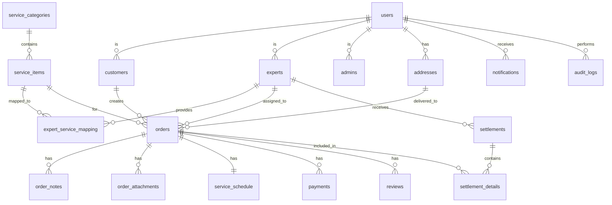

# 쓱싹 홈케어 플랫폼 - 데이터베이스 스키마 설계

**문서 버전**: 2.0  
**작성일**: 2026-01-14  
**우선순위**: P0 (최우선)  
**데이터베이스**: PostgreSQL 14+

---

## 📋 목차

1. [설계 원칙](#설계-원칙)
2. [ERD 다이어그램](#erd-다이어그램)
3. [테이블 상세 설계](#테이블-상세-설계)
4. [인덱스 전략](#인덱스-전략)
5. [마이그레이션 계획](#마이그레이션-계획)

---

## 설계 원칙

### 1. 확장성
- 향후 사용자 웹 추가를 고려한 통합 스키마
- 새로운 서비스 카테고리 추가 용이
- 파티셔닝 가능한 구조 (주문, 결제 테이블)

### 2. 무결성
- 외래키 제약조건 적용
- CHECK 제약조건으로 데이터 검증
- 트랜잭션 보장

### 3. 성능
- 적절한 인덱스 설계
- JSONB 활용으로 유연성 확보
- 파티셔닝 전략 (대용량 테이블)

### 4. 보안
- 민감 정보 암호화 (비밀번호, 계좌번호)
- Row Level Security (RLS) 고려
- 감사 로그 기록

---

## ERD 다이어그램



---

## 테이블 상세 설계

### 1. 사용자 관리

#### 1.1 users (사용자 기본 정보)
```sql
CREATE TABLE users (
    id UUID PRIMARY KEY DEFAULT gen_random_uuid(),
    email VARCHAR(255) UNIQUE NOT NULL,
    phone VARCHAR(20) UNIQUE NOT NULL,
    password_hash VARCHAR(255) NOT NULL,
    name VARCHAR(100) NOT NULL,
    role VARCHAR(20) NOT NULL CHECK (role IN ('customer', 'expert', 'admin')),
    status VARCHAR(20) DEFAULT 'active' CHECK (status IN ('active', 'inactive', 'pending', 'suspended')),
    avatar_url TEXT,
    email_verified BOOLEAN DEFAULT FALSE,
    phone_verified BOOLEAN DEFAULT FALSE,
    last_login_at TIMESTAMPTZ,
    metadata JSONB DEFAULT '{}',
    created_at TIMESTAMPTZ DEFAULT NOW(),
    updated_at TIMESTAMPTZ DEFAULT NOW(),
    deleted_at TIMESTAMPTZ
);

CREATE INDEX idx_users_email ON users(email) WHERE deleted_at IS NULL;
CREATE INDEX idx_users_phone ON users(phone) WHERE deleted_at IS NULL;
CREATE INDEX idx_users_role_status ON users(role, status) WHERE deleted_at IS NULL;
CREATE INDEX idx_users_created_at ON users(created_at DESC);

COMMENT ON TABLE users IS '사용자 기본 정보 (고객, 전문가, 관리자 공통)';
COMMENT ON COLUMN users.role IS '사용자 역할: customer(고객), expert(전문가), admin(관리자)';
COMMENT ON COLUMN users.status IS '계정 상태: active(활성), inactive(비활성), pending(승인대기), suspended(정지)';
```

#### 1.2 customers (고객 상세 정보)
```sql
CREATE TABLE customers (
    id UUID PRIMARY KEY REFERENCES users(id) ON DELETE CASCADE,
    default_address_id UUID REFERENCES addresses(id),
    total_spent DECIMAL(12, 2) DEFAULT 0,
    total_orders INTEGER DEFAULT 0,
    favorite_categories TEXT[] DEFAULT '{}',
    last_service_date TIMESTAMPTZ,
    preferences JSONB DEFAULT '{
        "notifications": true,
        "marketing": true,
        "language": "ko"
    }',
    created_at TIMESTAMPTZ DEFAULT NOW(),
    updated_at TIMESTAMPTZ DEFAULT NOW()
);

CREATE INDEX idx_customers_total_spent ON customers(total_spent DESC);
CREATE INDEX idx_customers_last_service_date ON customers(last_service_date DESC);

COMMENT ON TABLE customers IS '고객 전용 정보';
COMMENT ON COLUMN customers.total_spent IS '누적 지출액 (원)';
COMMENT ON COLUMN customers.total_orders IS '총 주문 수';
```

#### 1.3 experts (전문가 상세 정보)
```sql
CREATE TABLE experts (
    id UUID PRIMARY KEY REFERENCES users(id) ON DELETE CASCADE,
    business_name VARCHAR(255) NOT NULL,
    business_number VARCHAR(20) UNIQUE NOT NULL,
    business_type VARCHAR(50) NOT NULL CHECK (business_type IN ('individual', 'corporate')),
    business_address_id UUID REFERENCES addresses(id),
    service_regions TEXT[] NOT NULL,
    rating DECIMAL(3, 2) DEFAULT 0 CHECK (rating >= 0 AND rating <= 5),
    total_completed_orders INTEGER DEFAULT 0,
    total_earnings DECIMAL(12, 2) DEFAULT 0,
    expert_status VARCHAR(20) DEFAULT 'active' CHECK (expert_status IN ('active', 'inactive', 'busy', 'vacation')),
    bank_name VARCHAR(50),
    account_number VARCHAR(100),
    account_holder VARCHAR(100),
    introduction TEXT,
    certificate_urls TEXT[] DEFAULT '{}',
    portfolio_images TEXT[] DEFAULT '{}',
    metadata JSONB DEFAULT '{}',
    created_at TIMESTAMPTZ DEFAULT NOW(),
    updated_at TIMESTAMPTZ DEFAULT NOW()
);

CREATE INDEX idx_experts_rating ON experts(rating DESC);
CREATE INDEX idx_experts_service_regions ON experts USING GIN(service_regions);
CREATE INDEX idx_experts_status ON experts(expert_status);
CREATE INDEX idx_experts_business_number ON experts(business_number);

COMMENT ON TABLE experts IS '전문가 전용 정보';
COMMENT ON COLUMN experts.business_type IS '사업자 유형: individual(개인), corporate(법인)';
COMMENT ON COLUMN experts.expert_status IS '전문가 상태: active(활동중), inactive(비활동), busy(바쁨), vacation(휴가)';
COMMENT ON COLUMN experts.rating IS '평균 평점 (0.00 ~ 5.00)';
```

#### 1.4 admins (관리자 상세 정보)
```sql
CREATE TABLE admins (
    id UUID PRIMARY KEY REFERENCES users(id) ON DELETE CASCADE,
    department VARCHAR(100),
    position VARCHAR(100),
    permissions TEXT[] DEFAULT '{}',
    last_active_at TIMESTAMPTZ,
    created_at TIMESTAMPTZ DEFAULT NOW(),
    updated_at TIMESTAMPTZ DEFAULT NOW()
);

CREATE INDEX idx_admins_department ON admins(department);

COMMENT ON TABLE admins IS '관리자 전용 정보';
COMMENT ON COLUMN admins.permissions IS '권한 목록 (예: user_management, order_management)';
```

#### 1.5 addresses (주소 정보)
```sql
CREATE TABLE addresses (
    id UUID PRIMARY KEY DEFAULT gen_random_uuid(),
    user_id UUID NOT NULL REFERENCES users(id) ON DELETE CASCADE,
    label VARCHAR(50) NOT NULL,
    address_line1 VARCHAR(255) NOT NULL,
    address_line2 VARCHAR(255),
    city VARCHAR(100) NOT NULL,
    state VARCHAR(100) NOT NULL,
    postal_code VARCHAR(20) NOT NULL,
    country VARCHAR(50) DEFAULT 'South Korea',
    is_default BOOLEAN DEFAULT FALSE,
    latitude DECIMAL(10, 8),
    longitude DECIMAL(11, 8),
    metadata JSONB DEFAULT '{}',
    created_at TIMESTAMPTZ DEFAULT NOW(),
    updated_at TIMESTAMPTZ DEFAULT NOW()
);

CREATE INDEX idx_addresses_user_id ON addresses(user_id);
CREATE INDEX idx_addresses_coordinates ON addresses(latitude, longitude);
CREATE INDEX idx_addresses_is_default ON addresses(user_id, is_default) WHERE is_default = TRUE;

COMMENT ON TABLE addresses IS '사용자 주소 정보';
COMMENT ON COLUMN addresses.label IS '주소 라벨 (예: 집, 회사, 기타)';
```

---

### 2. 서비스 카탈로그

#### 2.1 service_categories (서비스 대분류)
```sql
CREATE TABLE service_categories (
    id UUID PRIMARY KEY DEFAULT gen_random_uuid(),
    name VARCHAR(100) UNIQUE NOT NULL,
    slug VARCHAR(100) UNIQUE NOT NULL,
    description TEXT,
    icon_url TEXT,
    display_order INTEGER DEFAULT 0,
    is_active BOOLEAN DEFAULT TRUE,
    metadata JSONB DEFAULT '{}',
    created_at TIMESTAMPTZ DEFAULT NOW(),
    updated_at TIMESTAMPTZ DEFAULT NOW()
);

CREATE INDEX idx_service_categories_slug ON service_categories(slug);
CREATE INDEX idx_service_categories_display_order ON service_categories(display_order);
CREATE INDEX idx_service_categories_is_active ON service_categories(is_active);

COMMENT ON TABLE service_categories IS '서비스 대분류 (예: 설치/시공, 클리닝, 막힘해결)';
COMMENT ON COLUMN service_categories.slug IS 'URL 친화적 식별자 (예: installation, cleaning)';
```

#### 2.2 service_items (서비스 세부 항목)
```sql
CREATE TABLE service_items (
    id UUID PRIMARY KEY DEFAULT gen_random_uuid(),
    category_id UUID NOT NULL REFERENCES service_categories(id) ON DELETE CASCADE,
    name VARCHAR(255) NOT NULL,
    description TEXT,
    base_price DECIMAL(10, 2) NOT NULL CHECK (base_price >= 0),
    estimated_time INTEGER CHECK (estimated_time > 0),
    requirements TEXT[] DEFAULT '{}',
    images TEXT[] DEFAULT '{}',
    is_active BOOLEAN DEFAULT TRUE,
    display_order INTEGER DEFAULT 0,
    metadata JSONB DEFAULT '{}',
    created_at TIMESTAMPTZ DEFAULT NOW(),
    updated_at TIMESTAMPTZ DEFAULT NOW()
);

CREATE INDEX idx_service_items_category_id ON service_items(category_id);
CREATE INDEX idx_service_items_is_active ON service_items(is_active);
CREATE INDEX idx_service_items_base_price ON service_items(base_price);
CREATE INDEX idx_service_items_display_order ON service_items(display_order);

COMMENT ON TABLE service_items IS '서비스 세부 항목';
COMMENT ON COLUMN service_items.base_price IS '기본 가격 (원)';
COMMENT ON COLUMN service_items.estimated_time IS '예상 소요 시간 (분)';
```

#### 2.3 expert_service_mapping (전문가-서비스 매핑)
```sql
CREATE TABLE expert_service_mapping (
    id UUID PRIMARY KEY DEFAULT gen_random_uuid(),
    expert_id UUID NOT NULL REFERENCES experts(id) ON DELETE CASCADE,
    service_item_id UUID NOT NULL REFERENCES service_items(id) ON DELETE CASCADE,
    custom_price DECIMAL(10, 2),
    is_available BOOLEAN DEFAULT TRUE,
    created_at TIMESTAMPTZ DEFAULT NOW(),
    updated_at TIMESTAMPTZ DEFAULT NOW(),
    UNIQUE(expert_id, service_item_id)
);

CREATE INDEX idx_expert_service_expert_id ON expert_service_mapping(expert_id);
CREATE INDEX idx_expert_service_service_id ON expert_service_mapping(service_item_id);
CREATE INDEX idx_expert_service_available ON expert_service_mapping(is_available);

COMMENT ON TABLE expert_service_mapping IS '전문가가 제공 가능한 서비스 매핑';
COMMENT ON COLUMN expert_service_mapping.custom_price IS '전문가 맞춤 가격 (NULL이면 기본 가격 사용)';
```

---

### 3. 주문 관리

#### 3.1 orders (주문)
```sql
CREATE TABLE orders (
    id UUID PRIMARY KEY DEFAULT gen_random_uuid(),
    order_number VARCHAR(50) UNIQUE NOT NULL,
    customer_id UUID NOT NULL REFERENCES customers(id),
    expert_id UUID REFERENCES experts(id),
    service_item_id UUID NOT NULL REFERENCES service_items(id),
    address_id UUID NOT NULL REFERENCES addresses(id),
    
    status VARCHAR(30) DEFAULT 'new' CHECK (status IN (
        'new', 'consult_required', 'schedule_pending', 'schedule_confirmed',
        'in_progress', 'payment_pending', 'paid', 'as_requested', 'cancelled'
    )),
    payment_status VARCHAR(30) DEFAULT 'pending' CHECK (payment_status IN (
        'pending', 'deposit_paid', 'balance_pending', 'balance_paid', 'refunded'
    )),
    
    requested_date TIMESTAMPTZ NOT NULL,
    confirmed_date TIMESTAMPTZ,
    started_at TIMESTAMPTZ,
    completed_at TIMESTAMPTZ,
    cancelled_at TIMESTAMPTZ,
    
    base_price DECIMAL(10, 2) NOT NULL,
    onsite_costs JSONB DEFAULT '[]',
    discount_amount DECIMAL(10, 2) DEFAULT 0,
    deposit_amount DECIMAL(10, 2) NOT NULL,
    total_amount DECIMAL(10, 2) NOT NULL,
    paid_amount DECIMAL(10, 2) DEFAULT 0,
    
    customer_notes TEXT,
    expert_notes TEXT,
    cancellation_reason TEXT,
    
    metadata JSONB DEFAULT '{}',
    created_at TIMESTAMPTZ DEFAULT NOW(),
    updated_at TIMESTAMPTZ DEFAULT NOW()
);

CREATE INDEX idx_orders_order_number ON orders(order_number);
CREATE INDEX idx_orders_customer_id ON orders(customer_id);
CREATE INDEX idx_orders_expert_id ON orders(expert_id);
CREATE INDEX idx_orders_status ON orders(status);
CREATE INDEX idx_orders_payment_status ON orders(payment_status);
CREATE INDEX idx_orders_requested_date ON orders(requested_date DESC);
CREATE INDEX idx_orders_created_at ON orders(created_at DESC);

COMMENT ON TABLE orders IS '주문 정보';
COMMENT ON COLUMN orders.order_number IS '주문 번호 (예: ORD-20260114-0001)';
COMMENT ON COLUMN orders.status IS '주문 상태';
COMMENT ON COLUMN orders.payment_status IS '결제 상태';
COMMENT ON COLUMN orders.onsite_costs IS '현장 추가 비용 JSON 배열';
```

#### 3.2 order_notes (주문 메모)
```sql
CREATE TABLE order_notes (
    id UUID PRIMARY KEY DEFAULT gen_random_uuid(),
    order_id UUID NOT NULL REFERENCES orders(id) ON DELETE CASCADE,
    author_id UUID NOT NULL REFERENCES users(id),
    author_type VARCHAR(20) NOT NULL CHECK (author_type IN ('customer', 'expert', 'admin')),
    content TEXT NOT NULL,
    is_internal BOOLEAN DEFAULT FALSE,
    created_at TIMESTAMPTZ DEFAULT NOW()
);

CREATE INDEX idx_order_notes_order_id ON order_notes(order_id);
CREATE INDEX idx_order_notes_created_at ON order_notes(created_at DESC);

COMMENT ON TABLE order_notes IS '주문 관련 메모';
COMMENT ON COLUMN order_notes.is_internal IS 'TRUE면 고객에게 보이지 않음';
```

#### 3.3 order_attachments (주문 첨부파일)
```sql
CREATE TABLE order_attachments (
    id UUID PRIMARY KEY DEFAULT gen_random_uuid(),
    order_id UUID NOT NULL REFERENCES orders(id) ON DELETE CASCADE,
    uploader_id UUID NOT NULL REFERENCES users(id),
    file_name VARCHAR(255) NOT NULL,
    file_url TEXT NOT NULL,
    file_type VARCHAR(50),
    file_size INTEGER,
    attachment_type VARCHAR(50) CHECK (attachment_type IN ('before', 'after', 'receipt', 'other')),
    created_at TIMESTAMPTZ DEFAULT NOW()
);

CREATE INDEX idx_order_attachments_order_id ON order_attachments(order_id);
CREATE INDEX idx_order_attachments_type ON order_attachments(attachment_type);

COMMENT ON TABLE order_attachments IS '주문 관련 첨부파일 (사진, 영수증 등)';
```

#### 3.4 service_schedule (서비스 일정)
```sql
CREATE TABLE service_schedule (
    id UUID PRIMARY KEY DEFAULT gen_random_uuid(),
    order_id UUID UNIQUE NOT NULL REFERENCES orders(id) ON DELETE CASCADE,
    expert_id UUID NOT NULL REFERENCES experts(id),
    scheduled_date DATE NOT NULL,
    start_time TIME NOT NULL,
    end_time TIME NOT NULL,
    status VARCHAR(20) DEFAULT 'scheduled' CHECK (status IN ('scheduled', 'in_progress', 'completed', 'cancelled')),
    notes TEXT,
    created_at TIMESTAMPTZ DEFAULT NOW(),
    updated_at TIMESTAMPTZ DEFAULT NOW()
);

CREATE INDEX idx_service_schedule_expert_id ON service_schedule(expert_id);
CREATE INDEX idx_service_schedule_date ON service_schedule(scheduled_date);
CREATE INDEX idx_service_schedule_status ON service_schedule(status);

COMMENT ON TABLE service_schedule IS '서비스 일정 정보';
```

---

### 4. 결제 및 정산

#### 4.1 payments (결제)
```sql
CREATE TABLE payments (
    id UUID PRIMARY KEY DEFAULT gen_random_uuid(),
    order_id UUID NOT NULL REFERENCES orders(id),
    payment_number VARCHAR(50) UNIQUE NOT NULL,
    payment_type VARCHAR(20) NOT NULL CHECK (payment_type IN ('deposit', 'balance', 'full')),
    method VARCHAR(30) CHECK (method IN ('credit_card', 'virtual_account', 'simple_payment', 'cash')),
    amount DECIMAL(10, 2) NOT NULL,
    status VARCHAR(20) DEFAULT 'pending' CHECK (status IN ('pending', 'completed', 'failed', 'cancelled', 'refunded')),
    
    pg_provider VARCHAR(50),
    pg_transaction_id VARCHAR(255),
    pg_response JSONB,
    
    paid_at TIMESTAMPTZ,
    refunded_at TIMESTAMPTZ,
    refund_amount DECIMAL(10, 2) DEFAULT 0,
    refund_reason TEXT,
    
    metadata JSONB DEFAULT '{}',
    created_at TIMESTAMPTZ DEFAULT NOW(),
    updated_at TIMESTAMPTZ DEFAULT NOW()
);

CREATE INDEX idx_payments_order_id ON payments(order_id);
CREATE INDEX idx_payments_payment_number ON payments(payment_number);
CREATE INDEX idx_payments_status ON payments(status);
CREATE INDEX idx_payments_paid_at ON payments(paid_at DESC);

COMMENT ON TABLE payments IS '결제 정보';
COMMENT ON COLUMN payments.payment_type IS '결제 유형: deposit(예약금), balance(잔금), full(전액)';
COMMENT ON COLUMN payments.pg_provider IS 'PG사 (예: toss_payments)';
```

#### 4.2 settlements (정산)
```sql
CREATE TABLE settlements (
    id UUID PRIMARY KEY DEFAULT gen_random_uuid(),
    expert_id UUID NOT NULL REFERENCES experts(id),
    settlement_number VARCHAR(50) UNIQUE NOT NULL,
    period_start DATE NOT NULL,
    period_end DATE NOT NULL,
    
    total_orders INTEGER DEFAULT 0,
    total_revenue DECIMAL(12, 2) DEFAULT 0,
    platform_fee DECIMAL(12, 2) DEFAULT 0,
    payment_fee DECIMAL(12, 2) DEFAULT 0,
    tax_amount DECIMAL(12, 2) DEFAULT 0,
    net_amount DECIMAL(12, 2) DEFAULT 0,
    
    status VARCHAR(20) DEFAULT 'pending' CHECK (status IN ('pending', 'approved', 'paid', 'cancelled')),
    approved_at TIMESTAMPTZ,
    paid_at TIMESTAMPTZ,
    
    bank_name VARCHAR(50),
    account_number VARCHAR(100),
    account_holder VARCHAR(100),
    
    notes TEXT,
    metadata JSONB DEFAULT '{}',
    created_at TIMESTAMPTZ DEFAULT NOW(),
    updated_at TIMESTAMPTZ DEFAULT NOW()
);

CREATE INDEX idx_settlements_expert_id ON settlements(expert_id);
CREATE INDEX idx_settlements_period ON settlements(period_start, period_end);
CREATE INDEX idx_settlements_status ON settlements(status);
CREATE INDEX idx_settlements_paid_at ON settlements(paid_at DESC);

COMMENT ON TABLE settlements IS '전문가 정산 정보';
COMMENT ON COLUMN settlements.platform_fee IS '플랫폼 수수료 (15%)';
COMMENT ON COLUMN settlements.payment_fee IS '결제 수수료 (2.5%)';
```

#### 4.3 settlement_details (정산 상세)
```sql
CREATE TABLE settlement_details (
    id UUID PRIMARY KEY DEFAULT gen_random_uuid(),
    settlement_id UUID NOT NULL REFERENCES settlements(id) ON DELETE CASCADE,
    order_id UUID NOT NULL REFERENCES orders(id),
    order_amount DECIMAL(10, 2) NOT NULL,
    platform_fee DECIMAL(10, 2) NOT NULL,
    payment_fee DECIMAL(10, 2) NOT NULL,
    net_amount DECIMAL(10, 2) NOT NULL,
    created_at TIMESTAMPTZ DEFAULT NOW()
);

CREATE INDEX idx_settlement_details_settlement_id ON settlement_details(settlement_id);
CREATE INDEX idx_settlement_details_order_id ON settlement_details(order_id);

COMMENT ON TABLE settlement_details IS '정산 상세 내역 (주문별)';
```

---

### 5. 리뷰 및 평가

#### 5.1 reviews (리뷰)
```sql
CREATE TABLE reviews (
    id UUID PRIMARY KEY DEFAULT gen_random_uuid(),
    order_id UUID UNIQUE NOT NULL REFERENCES orders(id),
    customer_id UUID NOT NULL REFERENCES customers(id),
    expert_id UUID NOT NULL REFERENCES experts(id),
    
    rating INTEGER NOT NULL CHECK (rating >= 1 AND rating <= 5),
    title VARCHAR(255),
    content TEXT NOT NULL,
    images TEXT[] DEFAULT '{}',
    
    is_verified BOOLEAN DEFAULT TRUE,
    is_approved BOOLEAN DEFAULT FALSE,
    approved_at TIMESTAMPTZ,
    
    helpful_count INTEGER DEFAULT 0,
    
    created_at TIMESTAMPTZ DEFAULT NOW(),
    updated_at TIMESTAMPTZ DEFAULT NOW()
);

CREATE INDEX idx_reviews_expert_id ON reviews(expert_id);
CREATE INDEX idx_reviews_customer_id ON reviews(customer_id);
CREATE INDEX idx_reviews_rating ON reviews(rating DESC);
CREATE INDEX idx_reviews_is_approved ON reviews(is_approved);
CREATE INDEX idx_reviews_created_at ON reviews(created_at DESC);

COMMENT ON TABLE reviews IS '서비스 리뷰';
COMMENT ON COLUMN reviews.is_verified IS '실제 구매자 여부';
COMMENT ON COLUMN reviews.is_approved IS '관리자 승인 여부';
```

---

### 6. 시스템 관리

#### 6.1 notifications (알림)
```sql
CREATE TABLE notifications (
    id UUID PRIMARY KEY DEFAULT gen_random_uuid(),
    user_id UUID NOT NULL REFERENCES users(id) ON DELETE CASCADE,
    type VARCHAR(50) NOT NULL,
    title VARCHAR(255) NOT NULL,
    message TEXT NOT NULL,
    data JSONB DEFAULT '{}',
    is_read BOOLEAN DEFAULT FALSE,
    read_at TIMESTAMPTZ,
    created_at TIMESTAMPTZ DEFAULT NOW()
);

CREATE INDEX idx_notifications_user_id ON notifications(user_id);
CREATE INDEX idx_notifications_is_read ON notifications(user_id, is_read);
CREATE INDEX idx_notifications_created_at ON notifications(created_at DESC);

COMMENT ON TABLE notifications IS '사용자 알림';
COMMENT ON COLUMN notifications.type IS '알림 유형 (예: order_created, payment_completed)';
```

#### 6.2 audit_logs (감사 로그)
```sql
CREATE TABLE audit_logs (
    id UUID PRIMARY KEY DEFAULT gen_random_uuid(),
    user_id UUID REFERENCES users(id),
    action VARCHAR(100) NOT NULL,
    entity_type VARCHAR(50) NOT NULL,
    entity_id UUID,
    old_values JSONB,
    new_values JSONB,
    ip_address INET,
    user_agent TEXT,
    created_at TIMESTAMPTZ DEFAULT NOW()
);

CREATE INDEX idx_audit_logs_user_id ON audit_logs(user_id);
CREATE INDEX idx_audit_logs_entity ON audit_logs(entity_type, entity_id);
CREATE INDEX idx_audit_logs_created_at ON audit_logs(created_at DESC);

COMMENT ON TABLE audit_logs IS '감사 로그 (모든 중요 작업 기록)';
```

---

## 인덱스 전략

### 1. 기본 인덱스
- 모든 Primary Key (자동 생성)
- 모든 Foreign Key
- UNIQUE 제약조건 (자동 생성)

### 2. 검색 최적화 인덱스
- 자주 조회되는 컬럼 (email, phone, order_number)
- 정렬에 사용되는 컬럼 (created_at, rating)
- 필터링에 사용되는 컬럼 (status, is_active)

### 3. 복합 인덱스
- (user_id, is_default) - 기본 주소 조회
- (role, status) - 사용자 필터링
- (period_start, period_end) - 정산 기간 조회

### 4. 부분 인덱스
- WHERE deleted_at IS NULL - Soft delete 지원
- WHERE is_active = TRUE - 활성 데이터만

### 5. GIN 인덱스
- TEXT[] 컬럼 (service_regions, permissions)
- JSONB 컬럼 (metadata)

---

## 마이그레이션 계획

### Phase 1: 기본 테이블 생성
```sql
-- 001_create_users_tables.sql
CREATE TABLE users ...
CREATE TABLE customers ...
CREATE TABLE experts ...
CREATE TABLE admins ...
CREATE TABLE addresses ...
```

### Phase 2: 서비스 카탈로그
```sql
-- 002_create_service_tables.sql
CREATE TABLE service_categories ...
CREATE TABLE service_items ...
CREATE TABLE expert_service_mapping ...
```

### Phase 3: 주문 시스템
```sql
-- 003_create_order_tables.sql
CREATE TABLE orders ...
CREATE TABLE order_notes ...
CREATE TABLE order_attachments ...
CREATE TABLE service_schedule ...
```

### Phase 4: 결제 및 정산
```sql
-- 004_create_payment_tables.sql
CREATE TABLE payments ...
CREATE TABLE settlements ...
CREATE TABLE settlement_details ...
```

### Phase 5: 리뷰 및 시스템
```sql
-- 005_create_review_system_tables.sql
CREATE TABLE reviews ...
CREATE TABLE notifications ...
CREATE TABLE audit_logs ...
```

### Phase 6: 초기 데이터
```sql
-- 006_seed_initial_data.sql
INSERT INTO service_categories ...
INSERT INTO service_items ...
```

---

## 다음 단계

1. **마이그레이션 스크립트 작성** - SQL 파일 생성
2. **Prisma/TypeORM 스키마 정의** - ORM 설정
3. **시드 데이터 준비** - 초기 데이터 작성
4. **백업 및 복구 전략** - 운영 계획 수립

---

**작성일**: 2026-01-14  
**버전**: 2.0  
**상태**: 스펙 작성 완료
