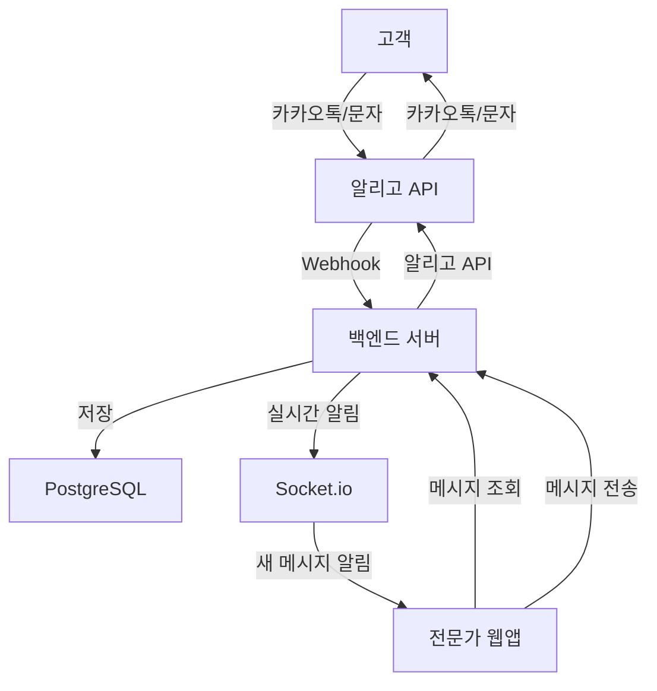

# 쓱싹 홈케어 플랫폼 - 메시징 시스템 스펙 (알리고 연동)

**문서 버전**: 2.0  
**작성일**: 2026-01-15  
**우선순위**: P2 (낮음)  
**상태**: 미구현

---

## 📋 목차

1. [개요](#개요)
2. [시스템 아키텍처](#시스템-아키텍처)
3. [알리고 API 연동](#알리고-api-연동)
4. [메시징 흐름](#메시징-흐름)
5. [백엔드 구현](#백엔드-구현)
6. [프론트엔드 구현](#프론트엔드-구현)
7. [데이터베이스 스키마](#데이터베이스-스키마)
8. [API 명세](#api-명세)
9. [구현 순서](#구현-순서)

---

## 개요

### 목적
전문가와 고객 간의 원활한 커뮤니케이션을 위한 메시징 시스템

### 핵심 가치
- **편의성**: 고객은 익숙한 카카오톡/문자 사용
- **효율성**: 전문가는 웹앱에서 통합 관리
- **신뢰성**: 메시지 히스토리 보관
- **접근성**: 별도 앱 설치 불필요

### 주요 특징
- **고객**: 카카오톡 알림톡 또는 SMS로 메시지 수신/발신
- **전문가**: 웹앱에서 메시지 확인 및 답장
- **양방향 통신**: 알리고 API를 통한 메시지 전송
- **히스토리 관리**: 모든 대화 내역 DB 저장

---

## 시스템 아키텍처



### 메시징 흐름

#### 고객 → 전문가
```
1. 고객이 카카오톡/문자로 답장
   ↓
2. 알리고 서버가 메시지 수신
   ↓
3. 알리고가 Webhook으로 백엔드에 전달
   ↓
4. 백엔드가 메시지 DB 저장
   ↓
5. Socket.io로 전문가에게 실시간 알림
   ↓
6. 전문가 웹앱에서 메시지 확인
```

#### 전문가 → 고객
```
1. 전문가가 웹앱에서 메시지 작성
   ↓
2. 백엔드 API로 메시지 전송 요청
   ↓
3. 백엔드가 메시지 DB 저장
   ↓
4. 알리고 API 호출 (카카오톡 알림톡 또는 SMS)
   ↓
5. 고객의 카카오톡/문자로 메시지 전달
```

---

## 알리고 API 연동

### 1. 알리고 서비스 개요

**알리고(Aligo)**: 국내 대표 문자/알림톡 발송 서비스
- 카카오톡 알림톡 발송
- SMS/LMS 발송
- Webhook을 통한 수신 메시지 처리
- 발송 결과 조회

### 2. 필요한 정보

```typescript
// 알리고 계정 정보
{
  apiKey: 'your_api_key',
  userId: 'your_user_id',
  senderKey: 'your_sender_key',  // 카카오톡 발신 프로필 키
  senderPhone: '02-1234-5678',   // SMS 발신번호
}
```

### 3. 알리고 API 엔드포인트

```typescript
// 카카오톡 알림톡 발송
POST https://kakaoapi.aligo.in/akv10/alimtalk/send/

// SMS 발송
POST https://apis.aligo.in/send/

// 발송 결과 조회
POST https://apis.aligo.in/list/

// Webhook 수신 (백엔드에서 구현)
POST https://your-domain.com/api/v1/messages/webhook
```

---

## 메시징 흐름

### 1. 카카오톡 알림톡 우선 전송

```typescript
// 전송 우선순위
1. 카카오톡 알림톡 시도
   ↓ (실패 시)
2. SMS로 대체 발송
```

### 2. 메시지 타입

#### 알림톡 템플릿
```
[쓱싹 홈케어]
전문가 {expertName}님의 메시지입니다.

{message}

답장하시려면 이 메시지에 답장해주세요.
```

#### SMS 템플릿
```
[쓱싹] {expertName}: {message}
답장 가능
```

---

## 백엔드 구현

### 1. 알리고 서비스

#### `backend/src/services/aligo.service.ts`
```typescript
import axios from 'axios';

interface AligoConfig {
  apiKey: string;
  userId: string;
  senderKey: string;
  senderPhone: string;
}

interface SendKakaoParams {
  receiver: string;      // 수신자 전화번호
  message: string;       // 메시지 내용
  templateCode: string;  // 알림톡 템플릿 코드
  variables?: Record<string, string>;  // 템플릿 변수
}

interface SendSMSParams {
  receiver: string;
  message: string;
}

export class AligoService {
  private config: AligoConfig;

  constructor(config: AligoConfig) {
    this.config = config;
  }

  /**
   * 카카오톡 알림톡 발송
   */
  async sendKakaoTalk(params: SendKakaoParams) {
    try {
      const response = await axios.post(
        'https://kakaoapi.aligo.in/akv10/alimtalk/send/',
        {
          apikey: this.config.apiKey,
          userid: this.config.userId,
          senderkey: this.config.senderKey,
          tpl_code: params.templateCode,
          sender: this.config.senderPhone,
          receiver_1: params.receiver,
          subject_1: '쓱싹 홈케어 메시지',
          message_1: params.message,
          // 템플릿 변수가 있는 경우
          ...params.variables,
        }
      );

      return {
        success: response.data.code === 0,
        messageId: response.data.info?.mid,
        error: response.data.message,
      };
    } catch (error) {
      console.error('Kakao talk send error:', error);
      throw error;
    }
  }

  /**
   * SMS 발송 (알림톡 실패 시 대체)
   */
  async sendSMS(params: SendSMSParams) {
    try {
      const response = await axios.post(
        'https://apis.aligo.in/send/',
        {
          key: this.config.apiKey,
          user_id: this.config.userId,
          sender: this.config.senderPhone,
          receiver: params.receiver,
          msg: params.message,
          msg_type: 'SMS',
          title: '쓱싹 홈케어',
        }
      );

      return {
        success: response.data.result_code === '1',
        messageId: response.data.msg_id,
        error: response.data.message,
      };
    } catch (error) {
      console.error('SMS send error:', error);
      throw error;
    }
  }

  /**
   * 메시지 발송 (알림톡 우선, 실패 시 SMS)
   */
  async sendMessage(params: {
    receiver: string;
    message: string;
    expertName: string;
  }) {
    // 1. 카카오톡 알림톡 시도
    try {
      const kakaoResult = await this.sendKakaoTalk({
        receiver: params.receiver,
        message: params.message,
        templateCode: 'EXPERT_MESSAGE',  // 사전 등록된 템플릿 코드
        variables: {
          expertName: params.expertName,
          message: params.message,
        },
      });

      if (kakaoResult.success) {
        return {
          type: 'kakao',
          success: true,
          messageId: kakaoResult.messageId,
        };
      }
    } catch (error) {
      console.log('Kakao talk failed, trying SMS...');
    }

    // 2. SMS 대체 발송
    const smsMessage = `[쓱싹] ${params.expertName}: ${params.message}\n답장 가능`;
    const smsResult = await this.sendSMS({
      receiver: params.receiver,
      message: smsMessage,
    });

    return {
      type: 'sms',
      success: smsResult.success,
      messageId: smsResult.messageId,
    };
  }

  /**
   * 발송 결과 조회
   */
  async getMessageStatus(messageId: string) {
    try {
      const response = await axios.post(
        'https://apis.aligo.in/list/',
        {
          key: this.config.apiKey,
          user_id: this.config.userId,
          mid: messageId,
        }
      );

      return {
        status: response.data.list[0]?.result,
        sentAt: response.data.list[0]?.reg_date,
      };
    } catch (error) {
      console.error('Get message status error:', error);
      throw error;
    }
  }
}

// 싱글톤 인스턴스
export const aligoService = new AligoService({
  apiKey: process.env.ALIGO_API_KEY!,
  userId: process.env.ALIGO_USER_ID!,
  senderKey: process.env.ALIGO_SENDER_KEY!,
  senderPhone: process.env.ALIGO_SENDER_PHONE!,
});
```

### 2. 메시지 컨트롤러

#### `backend/src/controllers/message.controller.ts`
```typescript
import { Request, Response } from 'express';
import { PrismaClient } from '@prisma/client';
import { aligoService } from '../services/aligo.service';
import { io } from '../index';

const prisma = new PrismaClient();

export const messageController = {
  /**
   * 대화방 목록 조회
   */
  async getConversations(req: Request, res: Response) {
    try {
      const expertId = req.user!.userId;

      const conversations = await prisma.conversation.findMany({
        where: { expertId },
        include: {
          customer: {
            select: {
              id: true,
              name: true,
              phone: true,
            },
          },
          order: {
            select: {
              id: true,
              orderNumber: true,
              status: true,
            },
          },
          _count: {
            select: {
              messages: {
                where: {
                  senderId: { not: expertId },
                  isRead: false,
                },
              },
            },
          },
        },
        orderBy: {
          lastMessageAt: 'desc',
        },
      });

      res.json({
        success: true,
        data: { conversations },
      });
    } catch (error) {
      res.status(500).json({
        success: false,
        error: { message: 'Failed to fetch conversations' },
      });
    }
  },

  /**
   * 메시지 히스토리 조회
   */
  async getMessages(req: Request, res: Response) {
    try {
      const { conversationId } = req.params;
      const expertId = req.user!.userId;
      const { page = 1, limit = 50 } = req.query;

      // 권한 확인
      const conversation = await prisma.conversation.findFirst({
        where: {
          id: conversationId,
          expertId,
        },
      });

      if (!conversation) {
        return res.status(404).json({
          success: false,
          error: { message: 'Conversation not found' },
        });
      }

      const [messages, total] = await Promise.all([
        prisma.message.findMany({
          where: { conversationId },
          include: {
            sender: {
              select: {
                id: true,
                name: true,
                role: true,
              },
            },
          },
          orderBy: { createdAt: 'desc' },
          skip: (Number(page) - 1) * Number(limit),
          take: Number(limit),
        }),
        prisma.message.count({ where: { conversationId } }),
      ]);

      // 읽지 않은 메시지 읽음 처리
      await prisma.message.updateMany({
        where: {
          conversationId,
          senderId: { not: expertId },
          isRead: false,
        },
        data: {
          isRead: true,
          readAt: new Date(),
        },
      });

      res.json({
        success: true,
        data: {
          messages: messages.reverse(),
          meta: {
            page: Number(page),
            limit: Number(limit),
            total,
          },
        },
      });
    } catch (error) {
      res.status(500).json({
        success: false,
        error: { message: 'Failed to fetch messages' },
      });
    }
  },

  /**
   * 메시지 전송 (전문가 → 고객)
   */
  async sendMessage(req: Request, res: Response) {
    try {
      const { conversationId } = req.params;
      const expertId = req.user!.userId;
      const { message } = req.body;

      // 대화방 조회
      const conversation = await prisma.conversation.findFirst({
        where: {
          id: conversationId,
          expertId,
        },
        include: {
          customer: true,
          expert: true,
        },
      });

      if (!conversation) {
        return res.status(404).json({
          success: false,
          error: { message: 'Conversation not found' },
        });
      }

      // 1. DB에 메시지 저장
      const savedMessage = await prisma.message.create({
        data: {
          conversationId,
          senderId: expertId,
          senderType: 'expert',
          content: message,
          messageType: 'text',
        },
        include: {
          sender: {
            select: {
              id: true,
              name: true,
              role: true,
            },
          },
        },
      });

      // 2. 대화방 업데이트
      await prisma.conversation.update({
        where: { id: conversationId },
        data: {
          lastMessage: message,
          lastMessageAt: new Date(),
        },
      });

      // 3. 알리고 API로 고객에게 전송
      const sendResult = await aligoService.sendMessage({
        receiver: conversation.customer.phone,
        message,
        expertName: conversation.expert.name,
      });

      // 4. 전송 결과 업데이트
      await prisma.message.update({
        where: { id: savedMessage.id },
        data: {
          deliveryStatus: sendResult.success ? 'sent' : 'failed',
          deliveryType: sendResult.type,
          externalMessageId: sendResult.messageId,
        },
      });

      res.json({
        success: true,
        data: savedMessage,
      });
    } catch (error) {
      console.error('Send message error:', error);
      res.status(500).json({
        success: false,
        error: { message: 'Failed to send message' },
      });
    }
  },

  /**
   * Webhook: 고객 답장 수신
   */
  async receiveWebhook(req: Request, res: Response) {
    try {
      const {
        sender,      // 발신자 전화번호 (고객)
        receiver,    // 수신자 전화번호 (쓱싹)
        message,     // 메시지 내용
        msg_id,      // 메시지 ID
      } = req.body;

      // 1. 발신자(고객) 조회
      const customer = await prisma.user.findFirst({
        where: {
          phone: sender,
          role: 'customer',
        },
      });

      if (!customer) {
        console.log('Customer not found:', sender);
        return res.json({ success: true }); // 200 응답 (알리고 재전송 방지)
      }

      // 2. 해당 고객의 활성 대화방 조회
      const conversation = await prisma.conversation.findFirst({
        where: {
          customerId: customer.id,
          // 최근 7일 이내 대화방
          lastMessageAt: {
            gte: new Date(Date.now() - 7 * 24 * 60 * 60 * 1000),
          },
        },
        include: {
          expert: true,
        },
        orderBy: {
          lastMessageAt: 'desc',
        },
      });

      if (!conversation) {
        console.log('No active conversation found for customer:', customer.id);
        return res.json({ success: true });
      }

      // 3. 메시지 저장
      const savedMessage = await prisma.message.create({
        data: {
          conversationId: conversation.id,
          senderId: customer.id,
          senderType: 'customer',
          content: message,
          messageType: 'text',
          deliveryStatus: 'received',
          externalMessageId: msg_id,
        },
        include: {
          sender: {
            select: {
              id: true,
              name: true,
              role: true,
            },
          },
        },
      });

      // 4. 대화방 업데이트
      await prisma.conversation.update({
        where: { id: conversation.id },
        data: {
          lastMessage: message,
          lastMessageAt: new Date(),
        },
      });

      // 5. 전문가에게 실시간 알림
      io.to(`user:${conversation.expertId}`).emit('message:new', {
        conversationId: conversation.id,
        message: savedMessage,
      });

      // 6. 알림 생성
      // TODO: NotificationService 연동
      // await NotificationService.create({
      //   userId: conversation.expertId,
      //   type: 'MESSAGE_RECEIVED',
      //   title: '새 메시지',
      //   message: `${customer.name}님의 메시지: ${message}`,
      //   link: `/messages/${conversation.id}`,
      // });

      res.json({ success: true });
    } catch (error) {
      console.error('Webhook error:', error);
      res.status(500).json({
        success: false,
        error: { message: 'Webhook processing failed' },
      });
    }
  },
};
```

### 3. 메시지 라우트

#### `backend/src/routes/message.routes.ts`
```typescript
import { Router } from 'express';
import { authenticate } from '../middleware/auth';
import { messageController } from '../controllers/message.controller';

const router = Router();

// Webhook (인증 불필요)
router.post('/webhook', messageController.receiveWebhook);

// 인증 필요
router.use(authenticate);

router.get('/conversations', messageController.getConversations);
router.get('/conversations/:conversationId/messages', messageController.getMessages);
router.post('/conversations/:conversationId/send', messageController.sendMessage);

export default router;
```

---

## 프론트엔드 구현

### 1. 메시지 서비스

#### `expert-webapp/src/services/message.service.ts`
```typescript
import { api } from '../lib/api';

export interface Conversation {
  id: string;
  orderId: string;
  expertId: string;
  customerId: string;
  lastMessage?: string;
  lastMessageAt?: string;
  customer: {
    id: string;
    name: string;
    phone: string;
  };
  order: {
    id: string;
    orderNumber: string;
    status: string;
  };
  _count: {
    messages: number;
  };
}

export interface Message {
  id: string;
  conversationId: string;
  senderId: string;
  senderType: 'expert' | 'customer';
  content: string;
  messageType: 'text';
  deliveryStatus: 'sent' | 'failed' | 'received';
  deliveryType?: 'kakao' | 'sms';
  isRead: boolean;
  readAt?: string;
  createdAt: string;
  sender: {
    id: string;
    name: string;
    role: string;
  };
}

export const messageService = {
  async getConversations() {
    const response = await api.get<{ conversations: Conversation[] }>('/messages/conversations');
    return response.data;
  },

  async getMessages(conversationId: string, params?: { page?: number; limit?: number }) {
    const response = await api.get<{
      messages: Message[];
      meta: { page: number; limit: number; total: number };
    }>(`/messages/conversations/${conversationId}/messages`, params);
    return response.data;
  },

  async sendMessage(conversationId: string, message: string) {
    const response = await api.post<Message>(
      `/messages/conversations/${conversationId}/send`,
      { message }
    );
    return response.data;
  },
};
```

### 2. 메시지 페이지

#### `expert-webapp/src/pages/MessagePage.tsx`
```typescript
import { useEffect, useRef, useState } from 'react';
import { useParams } from 'react-router-dom';
import Layout from '../components/Layout';
import { messageService, type Message } from '../services/message.service';
import { socketClient } from '../lib/socket';
import './MessagePage.css';

export default function MessagePage() {
  const { conversationId } = useParams<{ conversationId: string }>();
  const messagesEndRef = useRef<HTMLDivElement>(null);
  const [messages, setMessages] = useState<Message[]>([]);
  const [messageInput, setMessageInput] = useState('');
  const [loading, setLoading] = useState(false);
  const [sending, setSending] = useState(false);

  useEffect(() => {
    if (conversationId) {
      loadMessages();
      joinConversation();

      return () => {
        leaveConversation();
      };
    }
  }, [conversationId]);

  useEffect(() => {
    scrollToBottom();
  }, [messages]);

  const loadMessages = async () => {
    if (!conversationId) return;

    setLoading(true);
    try {
      const data = await messageService.getMessages(conversationId);
      setMessages(data.messages);
    } catch (error) {
      console.error('Failed to load messages:', error);
    } finally {
      setLoading(false);
    }
  };

  const joinConversation = () => {
    // 새 메시지 수신
    socketClient.on('message:new', (data: { message: Message }) => {
      if (data.message.conversationId === conversationId) {
        setMessages((prev) => [...prev, data.message]);
      }
    });
  };

  const leaveConversation = () => {
    socketClient.off('message:new');
  };

  const scrollToBottom = () => {
    messagesEndRef.current?.scrollIntoView({ behavior: 'smooth' });
  };

  const handleSendMessage = async () => {
    if (!messageInput.trim() || !conversationId || sending) return;

    setSending(true);
    try {
      const message = await messageService.sendMessage(conversationId, messageInput);
      setMessages((prev) => [...prev, message]);
      setMessageInput('');
    } catch (error) {
      console.error('Failed to send message:', error);
      alert('메시지 전송에 실패했습니다.');
    } finally {
      setSending(false);
    }
  };

  return (
    <Layout>
      <div className="message-page">
        <div className="message-header">
          <h2>고객 메시지</h2>
          <p className="info-text">
            고객은 카카오톡 또는 문자로 답장을 받습니다
          </p>
        </div>

        <div className="message-list">
          {loading ? (
            <div className="loading">로딩 중...</div>
          ) : (
            messages.map((message) => (
              <div
                key={message.id}
                className={`message-item ${
                  message.senderType === 'expert' ? 'sent' : 'received'
                }`}
              >
                <div className="message-bubble">
                  <p>{message.content}</p>
                  <div className="message-meta">
                    <span className="message-time">
                      {new Date(message.createdAt).toLocaleTimeString('ko-KR', {
                        hour: '2-digit',
                        minute: '2-digit',
                      })}
                    </span>
                    {message.senderType === 'expert' && (
                      <span className="delivery-status">
                        {message.deliveryType === 'kakao' ? '카톡' : 'SMS'}
                        {message.deliveryStatus === 'sent' ? ' ✓' : ' ✗'}
                      </span>
                    )}
                  </div>
                </div>
              </div>
            ))
          )}
          <div ref={messagesEndRef} />
        </div>

        <div className="message-input-area">
          <input
            type="text"
            value={messageInput}
            onChange={(e) => setMessageInput(e.target.value)}
            onKeyPress={(e) => e.key === 'Enter' && handleSendMessage()}
            placeholder="메시지를 입력하세요..."
            className="message-input"
            disabled={sending}
          />
          <button
            onClick={handleSendMessage}
            disabled={!messageInput.trim() || sending}
            className="send-btn"
          >
            {sending ? '전송 중...' : '전송'}
          </button>
        </div>
      </div>
    </Layout>
  );
}
```

---

## 데이터베이스 스키마

### Prisma Schema

```prisma
model Conversation {
  id            String   @id @default(cuid())
  orderId       String   @unique
  expertId      String
  customerId    String
  lastMessage   String?
  lastMessageAt DateTime?
  createdAt     DateTime @default(now())
  updatedAt     DateTime @updatedAt

  order    Order     @relation(fields: [orderId], references: [id], onDelete: Cascade)
  expert   User      @relation("ExpertConversations", fields: [expertId], references: [id])
  customer User      @relation("CustomerConversations", fields: [customerId], references: [id])
  messages Message[]

  @@index([expertId])
  @@index([customerId])
  @@index([lastMessageAt])
  @@map("conversations")
}

model Message {
  id                 String   @id @default(cuid())
  conversationId     String
  senderId           String
  senderType         String   // expert, customer
  content            String   @db.Text
  messageType        String   @default("text")  // text
  deliveryStatus     String?  // sent, failed, received
  deliveryType       String?  // kakao, sms
  externalMessageId  String?  // 알리고 메시지 ID
  isRead             Boolean  @default(false)
  readAt             DateTime?
  createdAt          DateTime @default(now())

  conversation Conversation @relation(fields: [conversationId], references: [id], onDelete: Cascade)
  sender       User         @relation(fields: [senderId], references: [id])

  @@index([conversationId, createdAt])
  @@index([senderId])
  @@map("messages")
}

// User 모델에 추가
model User {
  // ... 기존 필드 ...
  expertConversations   Conversation[] @relation("ExpertConversations")
  customerConversations Conversation[] @relation("CustomerConversations")
  messages              Message[]
}

// Order 모델에 추가
model Order {
  // ... 기존 필드 ...
  conversation Conversation?
}
```

---

## API 명세

### 1. 대화방 목록 조회
```
GET /api/v1/messages/conversations
Authorization: Bearer {token}

Response:
{
  "success": true,
  "data": {
    "conversations": [
      {
        "id": "conv_123",
        "orderId": "order_123",
        "lastMessage": "안녕하세요",
        "lastMessageAt": "2026-01-15T10:00:00Z",
        "customer": {
          "id": "user_123",
          "name": "김고객",
          "phone": "010-1234-5678"
        },
        "order": {
          "id": "order_123",
          "orderNumber": "ORD-20260115-001",
          "status": "in_progress"
        },
        "_count": {
          "messages": 3
        }
      }
    ]
  }
}
```

### 2. 메시지 히스토리 조회
```
GET /api/v1/messages/conversations/:conversationId/messages
Authorization: Bearer {token}

Response:
{
  "success": true,
  "data": {
    "messages": [
      {
        "id": "msg_123",
        "senderType": "customer",
        "content": "안녕하세요",
        "deliveryStatus": "received",
        "isRead": true,
        "createdAt": "2026-01-15T10:00:00Z",
        "sender": {
          "id": "user_123",
          "name": "김고객",
          "role": "customer"
        }
      }
    ],
    "meta": {
      "page": 1,
      "limit": 50,
      "total": 10
    }
  }
}
```

### 3. 메시지 전송
```
POST /api/v1/messages/conversations/:conversationId/send
Authorization: Bearer {token}

Body:
{
  "message": "네, 내일 오전 10시에 방문하겠습니다."
}

Response:
{
  "success": true,
  "data": {
    "id": "msg_124",
    "senderType": "expert",
    "content": "네, 내일 오전 10시에 방문하겠습니다.",
    "deliveryStatus": "sent",
    "deliveryType": "kakao",
    "createdAt": "2026-01-15T10:05:00Z"
  }
}
```

### 4. Webhook (알리고 → 백엔드)
```
POST /api/v1/messages/webhook

Body:
{
  "sender": "01012345678",      // 고객 전화번호
  "receiver": "0212345678",     // 쓱싹 전화번호
  "message": "네, 알겠습니다.",
  "msg_id": "aligo_msg_123"
}

Response:
{
  "success": true
}
```

---

## 구현 순서

### Phase 1: 알리고 연동 (2-3시간)
1. ✅ 알리고 계정 생성 및 API 키 발급
2. ✅ 카카오톡 알림톡 템플릿 등록
3. ✅ AligoService 구현
4. ✅ 테스트 메시지 발송

### Phase 2: 백엔드 구현 (3-4시간)
1. ✅ Conversation, Message 모델 추가
2. ✅ MessageController 구현
3. ✅ Webhook 엔드포인트 구현
4. ✅ API 라우트 추가

### Phase 3: 프론트엔드 구현 (2-3시간)
1. ✅ messageService 구현
2. ✅ MessagePage 컴포넌트
3. ✅ ConversationList 컴포넌트
4. ✅ 라우트 추가

### Phase 4: 테스트 및 최적화 (1-2시간)
1. ✅ 메시지 전송/수신 테스트
2. ✅ Webhook 테스트
3. ✅ UI/UX 개선
4. ✅ 에러 처리

---

## 환경 변수 설정

### `backend/.env`
```env
# 알리고 API 설정
ALIGO_API_KEY=your_api_key
ALIGO_USER_ID=your_user_id
ALIGO_SENDER_KEY=your_sender_key
ALIGO_SENDER_PHONE=02-1234-5678
```

---

## 알리고 템플릿 등록

### 카카오톡 알림톡 템플릿

**템플릿 코드**: `EXPERT_MESSAGE`

**템플릿 내용**:
```
[쓱싹 홈케어]
전문가 #{expertName}님의 메시지입니다.

#{message}

답장하시려면 이 메시지에 답장해주세요.
```

**변수**:
- `#{expertName}`: 전문가 이름
- `#{message}`: 메시지 내용

---

## 참고 자료

- [알리고 API 문서](https://smartsms.aligo.in/admin/api/info.html)
- [카카오톡 알림톡 가이드](https://smartsms.aligo.in/admin/api/kakao_info.html)
- [Webhook 설정 가이드](https://smartsms.aligo.in/admin/api/webhook.html)

---

**작성일**: 2026-01-15  
**버전**: 2.0  
**상태**: 스펙 작성 완료 (알리고 연동 방식)
