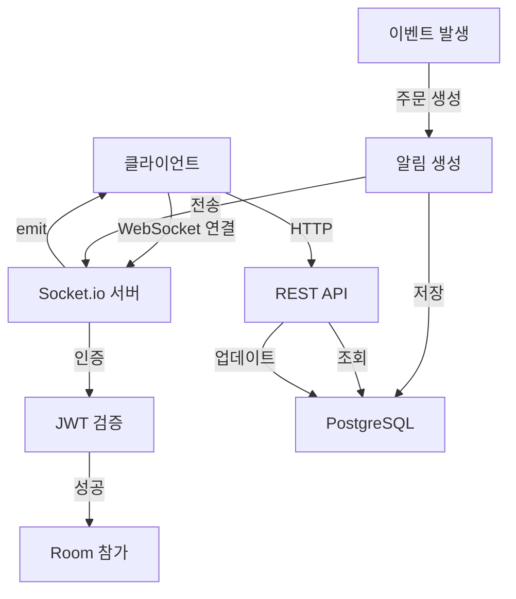

# 쓱싹 홈케어 플랫폼 - 실시간 알림 시스템 스펙

**문서 버전**: 1.0  
**작성일**: 2026-01-15  
**우선순위**: P1 (중간)  
**상태**: 미구현

---

## 📋 목차

1. [개요](#개요)
2. [기술 스택](#기술-스택)
3. [시스템 아키텍처](#시스템-아키텍처)
4. [알림 타입](#알림-타입)
5. [백엔드 구현](#백엔드-구현)
6. [프론트엔드 구현](#프론트엔드-구현)
7. [데이터베이스 스키마](#데이터베이스-스키마)
8. [API 명세](#api-명세)
9. [Socket.io 이벤트](#socketio-이벤트)
10. [구현 순서](#구현-순서)

---

## 개요

### 목적
전문가와 고객에게 주문, 일정, 정산 등의 중요한 이벤트를 실시간으로 알려주는 시스템

### 핵심 가치
- **즉시성**: 중요한 이벤트를 실시간으로 전달
- **신뢰성**: 알림 누락 방지
- **편의성**: 앱 내 알림 센터 제공
- **효율성**: 불필요한 폴링 제거

### 주요 기능
1. 실시간 알림 전송 (Socket.io)
2. 알림 센터 (읽음/안읽음 관리)
3. 알림 설정 (타입별 on/off)
4. 푸시 알림 (선택사항)

---

## 기술 스택

### 백엔드
```yaml
실시간 통신: Socket.io
서버: Express.js
인증: JWT
데이터베이스: PostgreSQL (Prisma)
```

### 프론트엔드
```yaml
Socket 클라이언트: socket.io-client
상태 관리: Zustand
UI 라이브러리: React
```

---

## 시스템 아키텍처



### 연결 흐름
```
1. 클라이언트 로그인
   ↓
2. JWT 토큰 발급
   ↓
3. Socket.io 연결 (토큰 포함)
   ↓
4. 서버에서 토큰 검증
   ↓
5. 사용자별 Room 참가
   ↓
6. 이벤트 발생 시 해당 Room으로 알림 전송
```

---

## 알림 타입

### 전문가용 알림

#### 1. 주문 관련
```typescript
{
  type: 'ORDER_NEW',
  title: '새로운 주문이 도착했습니다',
  message: '에어컨 설치 주문이 접수되었습니다.',
  data: {
    orderId: 'order_123',
    orderNumber: 'ORD-20260115-001',
    serviceName: '에어컨 설치',
    customerName: '김고객',
  },
  link: '/orders/order_123',
}

{
  type: 'ORDER_CANCELLED',
  title: '주문이 취소되었습니다',
  message: '고객이 주문을 취소했습니다.',
  data: {
    orderId: 'order_123',
    reason: '일정 변경',
  },
  link: '/orders/order_123',
}
```

#### 2. 일정 관련
```typescript
{
  type: 'SCHEDULE_REMINDER',
  title: '일정 알림',
  message: '1시간 후 서비스가 시작됩니다.',
  data: {
    orderId: 'order_123',
    scheduledTime: '2026-01-15T10:00:00Z',
    address: '서울시 강남구 테헤란로 123',
  },
  link: '/schedule',
}

{
  type: 'SCHEDULE_CHANGED',
  title: '일정이 변경되었습니다',
  message: '고객이 일정 변경을 요청했습니다.',
  data: {
    orderId: 'order_123',
    oldDate: '2026-01-15',
    newDate: '2026-01-16',
  },
  link: '/orders/order_123',
}
```

#### 3. 정산 관련
```typescript
{
  type: 'SETTLEMENT_READY',
  title: '정산이 준비되었습니다',
  message: '이번 주 정산 내역을 확인하세요.',
  data: {
    settlementId: 'settlement_123',
    amount: 1500000,
    period: '2026-01-08 ~ 2026-01-14',
  },
  link: '/settlements',
}

{
  type: 'SETTLEMENT_PAID',
  title: '정산금이 지급되었습니다',
  message: '1,500,000원이 입금되었습니다.',
  data: {
    settlementId: 'settlement_123',
    amount: 1500000,
  },
  link: '/settlements/settlement_123',
}
```

#### 4. 시스템 공지
```typescript
{
  type: 'SYSTEM_NOTICE',
  title: '시스템 점검 안내',
  message: '2026-01-20 02:00 ~ 04:00 시스템 점검이 예정되어 있습니다.',
  data: {
    startTime: '2026-01-20T02:00:00Z',
    endTime: '2026-01-20T04:00:00Z',
  },
  link: null,
}
```

### 고객용 알림

#### 1. 주문 관련
```typescript
{
  type: 'ORDER_ACCEPTED',
  title: '주문이 수락되었습니다',
  message: '전문가가 주문을 수락했습니다.',
  data: {
    orderId: 'order_123',
    expertName: '홍길동',
    scheduledDate: '2026-01-15',
  },
  link: '/orders/order_123',
}

{
  type: 'ORDER_STARTED',
  title: '서비스가 시작되었습니다',
  message: '전문가가 현장에 도착했습니다.',
  data: {
    orderId: 'order_123',
  },
  link: '/orders/order_123',
}

{
  type: 'ORDER_COMPLETED',
  title: '서비스가 완료되었습니다',
  message: '서비스 결과를 확인하고 리뷰를 남겨주세요.',
  data: {
    orderId: 'order_123',
  },
  link: '/orders/order_123',
}
```

#### 2. 결제 관련
```typescript
{
  type: 'PAYMENT_REQUIRED',
  title: '결제가 필요합니다',
  message: '잔금 120,000원을 결제해주세요.',
  data: {
    orderId: 'order_123',
    amount: 120000,
  },
  link: '/orders/order_123/payment',
}

{
  type: 'PAYMENT_COMPLETED',
  title: '결제가 완료되었습니다',
  message: '120,000원 결제가 완료되었습니다.',
  data: {
    orderId: 'order_123',
    amount: 120000,
  },
  link: '/orders/order_123',
}
```

---

## 백엔드 구현

### 1. Socket.io 서버 설정

#### `backend/src/socket/index.ts`
```typescript
import { Server } from 'socket.io';
import { Server as HttpServer } from 'http';
import { verifyToken } from '../utils/jwt';

export function initializeSocket(httpServer: HttpServer) {
  const io = new Server(httpServer, {
    cors: {
      origin: process.env.FRONTEND_URL || 'http://localhost:3001',
      credentials: true,
    },
  });

  // 인증 미들웨어
  io.use(async (socket, next) => {
    try {
      const token = socket.handshake.auth.token;
      if (!token) {
        return next(new Error('Authentication error'));
      }

      const decoded = verifyToken(token);
      socket.data.userId = decoded.userId;
      socket.data.role = decoded.role;
      next();
    } catch (error) {
      next(new Error('Authentication error'));
    }
  });

  // 연결 이벤트
  io.on('connection', (socket) => {
    const userId = socket.data.userId;
    const role = socket.data.role;

    console.log(`User connected: ${userId} (${role})`);

    // 사용자별 Room 참가
    socket.join(`user:${userId}`);
    socket.join(`role:${role}`);

    // 연결 해제
    socket.on('disconnect', () => {
      console.log(`User disconnected: ${userId}`);
    });
  });

  return io;
}
```

#### `backend/src/index.ts` (수정)
```typescript
import express from 'express';
import http from 'http';
import { initializeSocket } from './socket';

const app = express();
const httpServer = http.createServer(app);

// Socket.io 초기화
export const io = initializeSocket(httpServer);

// ... 기존 코드 ...

httpServer.listen(PORT, () => {
  console.log(`Server running on port ${PORT}`);
});
```

### 2. 알림 서비스

#### `backend/src/services/notification.service.ts`
```typescript
import { PrismaClient } from '@prisma/client';
import { io } from '../index';

const prisma = new PrismaClient();

export interface NotificationData {
  userId: string;
  type: string;
  title: string;
  message: string;
  data?: any;
  link?: string;
}

export class NotificationService {
  /**
   * 알림 생성 및 전송
   */
  static async create(notificationData: NotificationData) {
    // 1. DB에 저장
    const notification = await prisma.notification.create({
      data: {
        userId: notificationData.userId,
        type: notificationData.type,
        title: notificationData.title,
        message: notificationData.message,
        data: notificationData.data || {},
        link: notificationData.link,
        isRead: false,
      },
    });

    // 2. Socket.io로 실시간 전송
    io.to(`user:${notificationData.userId}`).emit('notification', notification);

    return notification;
  }

  /**
   * 여러 사용자에게 알림 전송
   */
  static async createMany(userIds: string[], notificationData: Omit<NotificationData, 'userId'>) {
    const notifications = await Promise.all(
      userIds.map((userId) =>
        this.create({
          userId,
          ...notificationData,
        })
      )
    );

    return notifications;
  }

  /**
   * 역할별 알림 전송 (예: 모든 전문가에게)
   */
  static async broadcastToRole(role: string, notificationData: Omit<NotificationData, 'userId'>) {
    // 해당 역할의 모든 사용자 조회
    const users = await prisma.user.findMany({
      where: { role },
      select: { id: true },
    });

    return this.createMany(
      users.map((u) => u.id),
      notificationData
    );
  }
}
```

### 3. 알림 컨트롤러

#### `backend/src/controllers/notification.controller.ts`
```typescript
import { Request, Response } from 'express';
import { PrismaClient } from '@prisma/client';

const prisma = new PrismaClient();

export const notificationController = {
  /**
   * 알림 목록 조회
   */
  async getNotifications(req: Request, res: Response) {
    try {
      const userId = req.user!.userId;
      const { page = 1, limit = 20, unreadOnly = false } = req.query;

      const where: any = { userId };
      if (unreadOnly === 'true') {
        where.isRead = false;
      }

      const [notifications, total] = await Promise.all([
        prisma.notification.findMany({
          where,
          orderBy: { createdAt: 'desc' },
          skip: (Number(page) - 1) * Number(limit),
          take: Number(limit),
        }),
        prisma.notification.count({ where }),
      ]);

      res.json({
        success: true,
        data: {
          notifications,
          meta: {
            page: Number(page),
            limit: Number(limit),
            total,
          },
        },
      });
    } catch (error) {
      res.status(500).json({
        success: false,
        error: { message: 'Failed to fetch notifications' },
      });
    }
  },

  /**
   * 알림 읽음 처리
   */
  async markAsRead(req: Request, res: Response) {
    try {
      const { notificationId } = req.params;
      const userId = req.user!.userId;

      const notification = await prisma.notification.updateMany({
        where: {
          id: notificationId,
          userId,
        },
        data: {
          isRead: true,
          readAt: new Date(),
        },
      });

      res.json({
        success: true,
        data: notification,
      });
    } catch (error) {
      res.status(500).json({
        success: false,
        error: { message: 'Failed to mark notification as read' },
      });
    }
  },

  /**
   * 모든 알림 읽음 처리
   */
  async markAllAsRead(req: Request, res: Response) {
    try {
      const userId = req.user!.userId;

      await prisma.notification.updateMany({
        where: {
          userId,
          isRead: false,
        },
        data: {
          isRead: true,
          readAt: new Date(),
        },
      });

      res.json({
        success: true,
        data: { message: 'All notifications marked as read' },
      });
    } catch (error) {
      res.status(500).json({
        success: false,
        error: { message: 'Failed to mark all notifications as read' },
      });
    }
  },

  /**
   * 알림 삭제
   */
  async deleteNotification(req: Request, res: Response) {
    try {
      const { notificationId } = req.params;
      const userId = req.user!.userId;

      await prisma.notification.deleteMany({
        where: {
          id: notificationId,
          userId,
        },
      });

      res.json({
        success: true,
        data: { message: 'Notification deleted' },
      });
    } catch (error) {
      res.status(500).json({
        success: false,
        error: { message: 'Failed to delete notification' },
      });
    }
  },

  /**
   * 읽지 않은 알림 개수
   */
  async getUnreadCount(req: Request, res: Response) {
    try {
      const userId = req.user!.userId;

      const count = await prisma.notification.count({
        where: {
          userId,
          isRead: false,
        },
      });

      res.json({
        success: true,
        data: { count },
      });
    } catch (error) {
      res.status(500).json({
        success: false,
        error: { message: 'Failed to get unread count' },
      });
    }
  },
};
```

### 4. 알림 라우트

#### `backend/src/routes/notification.routes.ts`
```typescript
import { Router } from 'express';
import { authenticate } from '../middleware/auth';
import { notificationController } from '../controllers/notification.controller';

const router = Router();

router.use(authenticate);

router.get('/', notificationController.getNotifications);
router.get('/unread-count', notificationController.getUnreadCount);
router.put('/:notificationId/read', notificationController.markAsRead);
router.put('/read-all', notificationController.markAllAsRead);
router.delete('/:notificationId', notificationController.deleteNotification);

export default router;
```

### 5. 이벤트 발행 예시

#### `backend/src/controllers/order.controller.ts` (수정)
```typescript
import { NotificationService } from '../services/notification.service';

// 주문 생성 시
export async function createOrder(req: Request, res: Response) {
  // ... 주문 생성 로직 ...

  // 전문가에게 알림 전송
  await NotificationService.create({
    userId: order.expertId,
    type: 'ORDER_NEW',
    title: '새로운 주문이 도착했습니다',
    message: `${order.serviceItem.name} 주문이 접수되었습니다.`,
    data: {
      orderId: order.id,
      orderNumber: order.orderNumber,
      serviceName: order.serviceItem.name,
      customerName: order.customer.name,
    },
    link: `/orders/${order.id}`,
  });

  // ... 응답 ...
}

// 주문 수락 시
export async function acceptOrder(req: Request, res: Response) {
  // ... 주문 수락 로직 ...

  // 고객에게 알림 전송
  await NotificationService.create({
    userId: order.customerId,
    type: 'ORDER_ACCEPTED',
    title: '주문이 수락되었습니다',
    message: '전문가가 주문을 수락했습니다.',
    data: {
      orderId: order.id,
      expertName: order.expert.name,
      scheduledDate: order.schedule.scheduledDate,
    },
    link: `/orders/${order.id}`,
  });

  // ... 응답 ...
}
```

---

## 프론트엔드 구현

### 1. Socket.io 클라이언트 설정

#### `expert-webapp/src/lib/socket.ts`
```typescript
import { io, Socket } from 'socket.io-client';

const SOCKET_URL = import.meta.env.VITE_SOCKET_URL || 'http://localhost:3000';

class SocketClient {
  private socket: Socket | null = null;

  connect(token: string) {
    if (this.socket?.connected) {
      return this.socket;
    }

    this.socket = io(SOCKET_URL, {
      auth: {
        token,
      },
    });

    this.socket.on('connect', () => {
      console.log('Socket connected');
    });

    this.socket.on('disconnect', () => {
      console.log('Socket disconnected');
    });

    this.socket.on('connect_error', (error) => {
      console.error('Socket connection error:', error);
    });

    return this.socket;
  }

  disconnect() {
    if (this.socket) {
      this.socket.disconnect();
      this.socket = null;
    }
  }

  on(event: string, callback: (...args: any[]) => void) {
    this.socket?.on(event, callback);
  }

  off(event: string, callback?: (...args: any[]) => void) {
    this.socket?.off(event, callback);
  }

  emit(event: string, ...args: any[]) {
    this.socket?.emit(event, ...args);
  }

  get connected() {
    return this.socket?.connected || false;
  }
}

export const socketClient = new SocketClient();
```

### 2. 알림 스토어

#### `expert-webapp/src/store/notificationStore.ts`
```typescript
import { create } from 'zustand';
import { socketClient } from '../lib/socket';
import { notificationService, type Notification } from '../services/notification.service';

interface NotificationStore {
  notifications: Notification[];
  unreadCount: number;
  isLoading: boolean;
  
  // Actions
  loadNotifications: () => Promise<void>;
  loadUnreadCount: () => Promise<void>;
  markAsRead: (notificationId: string) => Promise<void>;
  markAllAsRead: () => Promise<void>;
  deleteNotification: (notificationId: string) => Promise<void>;
  addNotification: (notification: Notification) => void;
  initializeSocket: (token: string) => void;
  disconnectSocket: () => void;
}

export const useNotificationStore = create<NotificationStore>((set, get) => ({
  notifications: [],
  unreadCount: 0,
  isLoading: false,

  loadNotifications: async () => {
    set({ isLoading: true });
    try {
      const data = await notificationService.getNotifications();
      set({ notifications: data.notifications });
    } catch (error) {
      console.error('Failed to load notifications:', error);
    } finally {
      set({ isLoading: false });
    }
  },

  loadUnreadCount: async () => {
    try {
      const data = await notificationService.getUnreadCount();
      set({ unreadCount: data.count });
    } catch (error) {
      console.error('Failed to load unread count:', error);
    }
  },

  markAsRead: async (notificationId: string) => {
    try {
      await notificationService.markAsRead(notificationId);
      set((state) => ({
        notifications: state.notifications.map((n) =>
          n.id === notificationId ? { ...n, isRead: true } : n
        ),
        unreadCount: Math.max(0, state.unreadCount - 1),
      }));
    } catch (error) {
      console.error('Failed to mark as read:', error);
    }
  },

  markAllAsRead: async () => {
    try {
      await notificationService.markAllAsRead();
      set((state) => ({
        notifications: state.notifications.map((n) => ({ ...n, isRead: true })),
        unreadCount: 0,
      }));
    } catch (error) {
      console.error('Failed to mark all as read:', error);
    }
  },

  deleteNotification: async (notificationId: string) => {
    try {
      await notificationService.deleteNotification(notificationId);
      set((state) => ({
        notifications: state.notifications.filter((n) => n.id !== notificationId),
      }));
    } catch (error) {
      console.error('Failed to delete notification:', error);
    }
  },

  addNotification: (notification: Notification) => {
    set((state) => ({
      notifications: [notification, ...state.notifications],
      unreadCount: state.unreadCount + 1,
    }));
  },

  initializeSocket: (token: string) => {
    socketClient.connect(token);

    // 실시간 알림 수신
    socketClient.on('notification', (notification: Notification) => {
      get().addNotification(notification);
      
      // 브라우저 알림 (권한이 있는 경우)
      if (Notification.permission === 'granted') {
        new Notification(notification.title, {
          body: notification.message,
          icon: '/logo.svg',
        });
      }
    });
  },

  disconnectSocket: () => {
    socketClient.disconnect();
  },
}));
```

### 3. 알림 서비스

#### `expert-webapp/src/services/notification.service.ts`
```typescript
import { api } from '../lib/api';

export interface Notification {
  id: string;
  userId: string;
  type: string;
  title: string;
  message: string;
  data: any;
  link?: string;
  isRead: boolean;
  readAt?: string;
  createdAt: string;
}

export const notificationService = {
  async getNotifications(params?: { page?: number; limit?: number; unreadOnly?: boolean }) {
    const response = await api.get<{
      notifications: Notification[];
      meta: { page: number; limit: number; total: number };
    }>('/notifications', params);
    return response.data;
  },

  async getUnreadCount() {
    const response = await api.get<{ count: number }>('/notifications/unread-count');
    return response.data;
  },

  async markAsRead(notificationId: string) {
    const response = await api.put(`/notifications/${notificationId}/read`);
    return response.data;
  },

  async markAllAsRead() {
    const response = await api.put('/notifications/read-all');
    return response.data;
  },

  async deleteNotification(notificationId: string) {
    const response = await api.delete(`/notifications/${notificationId}`);
    return response.data;
  },
};
```

### 4. 알림 센터 컴포넌트

#### `expert-webapp/src/components/NotificationCenter.tsx`
```typescript
import { useEffect, useState } from 'react';
import { useNavigate } from 'react-router-dom';
import { useNotificationStore } from '../store/notificationStore';
import './NotificationCenter.css';

export default function NotificationCenter() {
  const navigate = useNavigate();
  const [isOpen, setIsOpen] = useState(false);
  const {
    notifications,
    unreadCount,
    loadNotifications,
    markAsRead,
    markAllAsRead,
    deleteNotification,
  } = useNotificationStore();

  useEffect(() => {
    if (isOpen) {
      loadNotifications();
    }
  }, [isOpen]);

  const handleNotificationClick = async (notification: any) => {
    if (!notification.isRead) {
      await markAsRead(notification.id);
    }
    if (notification.link) {
      navigate(notification.link);
    }
    setIsOpen(false);
  };

  return (
    <div className="notification-center">
      <button
        className="notification-bell"
        onClick={() => setIsOpen(!isOpen)}
      >
        🔔
        {unreadCount > 0 && (
          <span className="notification-badge">{unreadCount}</span>
        )}
      </button>

      {isOpen && (
        <div className="notification-dropdown">
          <div className="notification-header">
            <h3>알림</h3>
            {unreadCount > 0 && (
              <button onClick={markAllAsRead} className="mark-all-read">
                모두 읽음
              </button>
            )}
          </div>

          <div className="notification-list">
            {notifications.length === 0 ? (
              <div className="empty-notifications">
                알림이 없습니다.
              </div>
            ) : (
              notifications.map((notification) => (
                <div
                  key={notification.id}
                  className={`notification-item ${
                    notification.isRead ? 'read' : 'unread'
                  }`}
                  onClick={() => handleNotificationClick(notification)}
                >
                  <div className="notification-content">
                    <h4>{notification.title}</h4>
                    <p>{notification.message}</p>
                    <span className="notification-time">
                      {new Date(notification.createdAt).toLocaleString('ko-KR')}
                    </span>
                  </div>
                  <button
                    className="delete-btn"
                    onClick={(e) => {
                      e.stopPropagation();
                      deleteNotification(notification.id);
                    }}
                  >
                    ✕
                  </button>
                </div>
              ))
            )}
          </div>
        </div>
      )}
    </div>
  );
}
```

---

## 데이터베이스 스키마

### Prisma Schema 추가

```prisma
model Notification {
  id        String   @id @default(cuid())
  userId    String
  type      String   // ORDER_NEW, ORDER_ACCEPTED, SCHEDULE_REMINDER, etc.
  title     String
  message   String
  data      Json     @default("{}")
  link      String?
  isRead    Boolean  @default(false)
  readAt    DateTime?
  createdAt DateTime @default(now())
  updatedAt DateTime @updatedAt

  user User @relation(fields: [userId], references: [id], onDelete: Cascade)

  @@index([userId, isRead])
  @@index([userId, createdAt])
  @@map("notifications")
}

// User 모델에 추가
model User {
  // ... 기존 필드 ...
  notifications Notification[]
}
```

---

## API 명세

### 1. 알림 목록 조회
```
GET /api/v1/notifications
Authorization: Bearer {token}

Query Parameters:
- page: number (default: 1)
- limit: number (default: 20)
- unreadOnly: boolean (default: false)

Response:
{
  "success": true,
  "data": {
    "notifications": [
      {
        "id": "notif_123",
        "type": "ORDER_NEW",
        "title": "새로운 주문이 도착했습니다",
        "message": "에어컨 설치 주문이 접수되었습니다.",
        "data": { ... },
        "link": "/orders/order_123",
        "isRead": false,
        "createdAt": "2026-01-15T10:00:00Z"
      }
    ],
    "meta": {
      "page": 1,
      "limit": 20,
      "total": 50
    }
  }
}
```

### 2. 읽지 않은 알림 개수
```
GET /api/v1/notifications/unread-count
Authorization: Bearer {token}

Response:
{
  "success": true,
  "data": {
    "count": 5
  }
}
```

### 3. 알림 읽음 처리
```
PUT /api/v1/notifications/:notificationId/read
Authorization: Bearer {token}

Response:
{
  "success": true,
  "data": { ... }
}
```

### 4. 모든 알림 읽음 처리
```
PUT /api/v1/notifications/read-all
Authorization: Bearer {token}

Response:
{
  "success": true,
  "data": {
    "message": "All notifications marked as read"
  }
}
```

### 5. 알림 삭제
```
DELETE /api/v1/notifications/:notificationId
Authorization: Bearer {token}

Response:
{
  "success": true,
  "data": {
    "message": "Notification deleted"
  }
}
```

---

## Socket.io 이벤트

### 클라이언트 → 서버
```typescript
// 연결 시 인증
socket.auth = {
  token: 'jwt_token_here'
};
```

### 서버 → 클라이언트
```typescript
// 실시간 알림
socket.on('notification', (notification) => {
  console.log('New notification:', notification);
});
```

---

## 구현 순서

### Phase 1: 백엔드 기본 구조 (2-3시간)
1. ✅ Socket.io 서버 설정
2. ✅ Notification 모델 추가 (Prisma)
3. ✅ NotificationService 구현
4. ✅ NotificationController 구현
5. ✅ API 라우트 추가

### Phase 2: 프론트엔드 기본 구조 (2-3시간)
1. ✅ socket.io-client 설치 및 설정
2. ✅ notificationStore 구현
3. ✅ notificationService 구현
4. ✅ NotificationCenter 컴포넌트
5. ✅ Layout에 NotificationCenter 추가

### Phase 3: 이벤트 연동 (1-2시간)
1. ✅ 주문 생성 시 알림 발송
2. ✅ 주문 수락 시 알림 발송
3. ✅ 주문 완료 시 알림 발송
4. ✅ 정산 준비 시 알림 발송

### Phase 4: 테스트 및 최적화 (1-2시간)
1. ✅ 실시간 알림 테스트
2. ✅ 알림 센터 UI/UX 개선
3. ✅ 성능 최적화
4. ✅ 에러 처리

---

## 참고 자료

- [Socket.io 공식 문서](https://socket.io/docs/v4/)
- [Prisma 공식 문서](https://www.prisma.io/docs)
- [Web Notifications API](https://developer.mozilla.org/en-US/docs/Web/API/Notifications_API)

---

**작성일**: 2026-01-15  
**버전**: 1.0  
**상태**: 스펙 작성 완료
